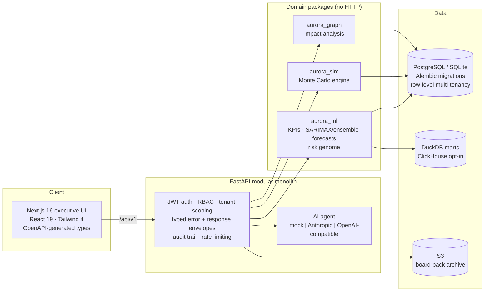

# AURORA — Enterprise Decision Intelligence OS

[](https://github.com/Ekam-Bindra/aurora/actions/workflows/ci.yml)
[](LICENSE)


A multi-tenant SaaS platform that unifies a company's financial, operational, and
relationship data into **live KPIs, probabilistic forecasts, an eight-dimension risk
genome, knowledge-graph impact analysis, Monte Carlo decision simulations, exportable
board packs, and an explainable executive AI agent**.

Core product principle: **if AURORA can't show its work, it doesn't show the number.**
Every computed output carries its formula, inputs, and evidence references — one click
from any figure to how it was derived.

The repo ships a complete demo tenant (*Nimbus Retail Systems*): a seeded 36-month
retail dataset with seven engineered anomalies (marketing spike, revenue dip, liquidity
squeeze, concentration creep, vendor slip, margin erosion, attrition cluster) that the
platform detects, scores, and explains. **No cloud account, API keys, or Docker
required to run it.**

---

## Run it in two minutes (macOS / Linux; Windows via WSL)

Prerequisites: **Python 3.9+** and **Node 20+** (pnpm activates automatically via corepack).

```bash
git clone https://github.com/Ekam-Bindra/aurora.git && cd aurora
corepack enable
./scripts/local-run.sh
```

That single script creates a virtualenv, installs every package, runs the API test
suite, seeds the demo tenant into SQLite, and serves the API on `:8000`. In a second
terminal:

```bash
cd aurora
./scripts/dev-web.sh
```

Open **http://localhost:3000** → log in with **`cfo@nimbus.test` / `aurora-demo-2026`**.

**Five-minute tour:** Overview (live KPIs) → Risk Genome (spot the engineered
liquidity squeeze) → Forecasting (switch method to *Auto* and open "Why this method" —
the rolling-backtest evidence) → Simulations (run a −10% revenue shock, 10k Monte Carlo
trials) → AI Agent ("what happens to runway if revenue drops 15%?") → Board Reports
(generate a pack, download the PDF) → Data Sources (upload a CSV, watch the job) →
Admin (browse the audit trail every one of those actions just wrote).

---

## Architecture



**Monorepo layout**

| Path | What it is |
|------|------------|
| `apps/api` | FastAPI backend — auth, RBAC, 12 route modules, OpenAPI |
| `apps/web` | Next.js App Router UI — dashboard, explorers, Playwright E2E |
| `packages/database` | SQLAlchemy models, Alembic, demo-tenant seeder with self-verification |
| `packages/ml` | Financial engine, forecast models (baseline/SARIMAX/ensemble/auto), risk scoring |
| `packages/simulations` | Monte Carlo engine (10k-trial scenario runs, seeded + reproducible) |
| `packages/graph` | Knowledge-graph projection + impact traversal |
| `packages/analytics` | Mart backends (Postgres/DuckDB, ClickHouse path) |
| `infra/terraform` | Complete AWS stack: VPC, ECS Fargate, ALB, RDS, ECR, alarms, dashboard |
| `.github/workflows` | 8-job CI, continuous deployment with health gates, scheduled SLO checks |

---

## Engineering highlights

- **Tested like it matters** — 150+ pytest across six packages (golden values on the
  seeded dataset, cross-instance persistence proofs, tenant-isolation probes) plus 4
  Playwright end-to-end CFO flows; 8 required CI checks gate every merge to the
  protected `main`.
- **Correct behind a load balancer** — reports, ingestion jobs, simulation runs, and
  agent chat are database-backed with tests that boot the app twice against one
  database to prove artifacts survive process switches.
- **Explainable forecasting** — the *auto* method runs a rolling-origin backtest and
  attaches the evidence (`selected`, per-method MAPE, holdout size) to the forecast;
  the UI renders it as "Why this method".
- **Real PDFs, durably archived** — multi-page reportlab board packs, written through
  to S3 with presigned sharing links (best-effort: storage failure never blocks a
  download).
- **Production-shaped delivery** — Terraform-defined AWS stack (deployed, drilled, and
  torn down on demand); merge-to-main auto-deploys with an ALB health gate and
  one-click Alembic migrations via a one-off ECS task; CloudWatch alarms + operations
  dashboard; documented DR runbook with **measured** drills: cold rebuild ≈ 30 min,
  and a live task-kill drill that served **90/90 probes with zero downtime**. Load
  test against the live stack: **965/965 checks, 0% failures, p95 35.6 ms**.
- **Security posture** — per-tenant row isolation on every query, RBAC permission
  guards, append-only audit trail on every sensitive mutation, secret scanning + push
  protection, least-privilege OIDC deploy role, secrets only ever in AWS Secrets
  Manager.

## The AI agent

Ships with a deterministic **mock provider** so the whole demo runs offline. Flip one
environment variable for a live model — the agent grounds its answers in the tenant's
actual metrics, risk genome, and on-demand Monte Carlo runs, and returns the same
citation trail regardless of provider:

```bash
AI_PROVIDER=anthropic ANTHROPIC_API_KEY=sk-ant-...
```

Any OpenAI-compatible endpoint also works (including free tiers such as Groq):

```bash
AI_PROVIDER=openai OPENAI_API_KEY=gsk-... OPENAI_BASE_URL=https://api.groq.com/openai OPENAI_MODEL=llama-3.3-70b-versatile
```

## Tests

```bash
source apps/api/.venv/bin/activate
for d in apps/api packages/database packages/ml packages/graph packages/simulations packages/analytics; do (cd "$d" && ruff check . && pytest -q) || break; done
```

```bash
cd apps/web
pnpm test:e2e:install
pnpm test:e2e
```

## Cloud deployment

The entire AWS environment is code: `terraform apply` builds VPC → ALB → ECS Fargate →
RDS Postgres → ECR → Secrets Manager → CloudWatch alarms/dashboard, and every merge to
`main` ships images and redeploys behind a health gate. See
[`docs/DEPLOY-CHECKLIST.md`](docs/DEPLOY-CHECKLIST.md) for first-deploy steps and
[`docs/RUNBOOK-DR.md`](docs/RUNBOOK-DR.md) for backup/restore, secret rotation, and the
30-minute destroy⇄rebuild drill. (The demo stack is intentionally torn down when not in
use — rebuilding it is one command + one workflow run.)

## Documentation

| Doc | Purpose |
|-----|---------|
| [`docs/MASTER-PROMPT.md`](docs/MASTER-PROMPT.md) | Verified system state, hard-won correctness facts, engineering standards, ranked backlog |
| [`docs/architecture/system-architecture.md`](docs/architecture/system-architecture.md) | Full architecture + ADRs |
| [`docs/data-model/data-model.md`](docs/data-model/data-model.md) | Multi-tenant schema (21+ tables) |
| [`docs/PROJECT-MASTER-GUIDE.md`](docs/PROJECT-MASTER-GUIDE.md) | Operational handbook |
| [`docs/RUNBOOK-DR.md`](docs/RUNBOOK-DR.md) | DR procedures + drill log |

## License

[MIT](LICENSE) © 2026 Ekam Bindra
