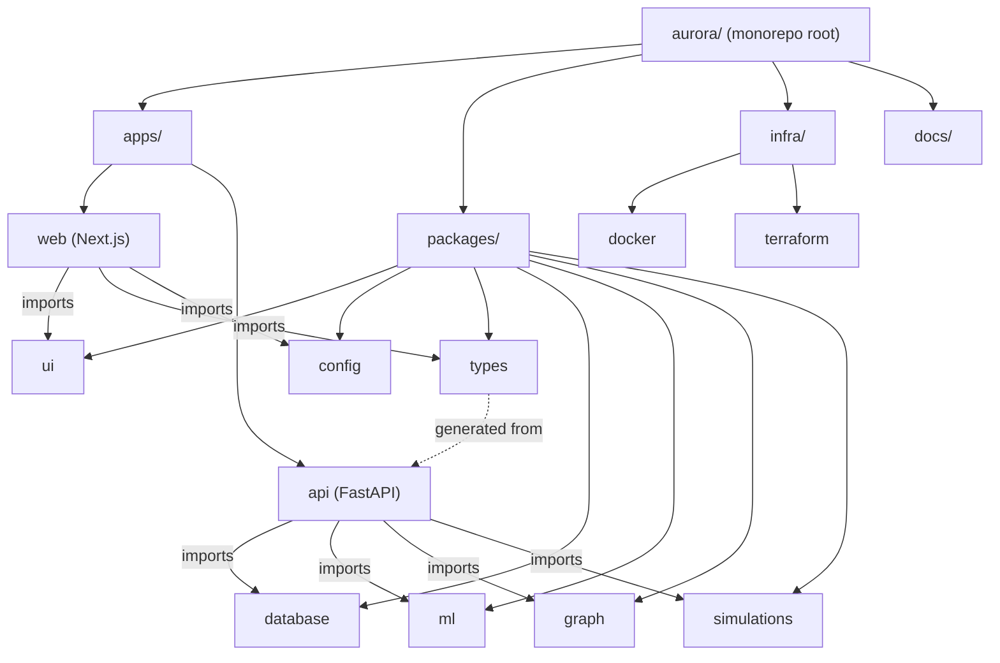

# AURORA — Monorepo Folder Structure

> **Document status:** Foundational. Defines the repository layout and the responsibility of
> every app and package, so future build sessions know exactly where code belongs.
>
> **Related:** [System Architecture](system-architecture.md) ·
> [Data Model](../data-model/data-model.md) · [API Specification](../api/api-specification.md) ·
> [Deployment Guide](../deployment/deployment-guide.md)

---

## 1. Why a monorepo

AURORA spans a TypeScript frontend and a Python backend that share concepts (entities, API
contracts, metric/risk definitions). A monorepo gives us:

- **One source of truth** for types and contracts (generated from the API → consumed by web).
- **Atomic changes** across web + api + packages in a single PR.
- **Shared tooling** (lint, format, CI) and consistent versioning.
- **Clear module boundaries** that mirror the [12-module architecture](system-architecture.md#4-the-12-modules-in-detail).

Tooling: **pnpm workspaces + Turborepo** for the JS/TS side; **uv/Poetry** for the Python side;
both orchestrated by root scripts and GitHub Actions.

---

## 2. Top-level layout

```text
aurora/
├── apps/                      # Deployable applications
│   ├── web/                   # Next.js executive frontend
│   └── api/                   # FastAPI backend (modular monolith)
├── packages/                  # Shared, reusable libraries
│   ├── ui/                    # React component library (shadcn/ui based)
│   ├── config/               # Shared config: eslint, tsconfig, tailwind, env schema
│   ├── types/                 # Shared TypeScript types + generated API client
│   ├── database/              # SQLAlchemy models, migrations, seed/demo data
│   ├── ml/                    # Forecasting, risk, AI provider abstraction
│   ├── graph/                 # Neo4j models, sync, Cypher queries
│   └── simulations/           # Monte Carlo decision-simulation engine
├── infra/                     # Infrastructure as code & runtime
│   ├── docker/                # Dockerfiles + docker-compose for local stack
│   └── terraform/             # Optional AWS provisioning (ECS/RDS/S3/...)
├── docs/                      # All design & architecture documentation (this tree)
├── scripts/                   # Repo-wide dev/ops scripts
├── .github/                   # GitHub Actions workflows, issue/PR templates
├── .env.example               # Documented environment variables
├── package.json               # Root workspace (pnpm + turbo)
├── pnpm-workspace.yaml         # Workspace package globs
├── turbo.json                 # Turborepo pipeline
└── README.md                  # Project entry point + doc index
```



---

## 3. `apps/` — deployable applications

### 3.1 `apps/web` — Next.js executive frontend

Implements modules **10 (Executive Dashboard)** and **11 (Board Report UI)** plus the front
ends of every other module. Detailed UX in [UI/UX Plan](ui-ux-plan.md).

```text
apps/web/
├── app/                       # Next.js App Router
│   ├── (auth)/                # login, password reset (public)
│   ├── (dashboard)/           # authenticated shell + executive dashboard
│   │   ├── overview/          # KPIs, trends, risk genome, alerts
│   │   ├── financials/        # financial intelligence views
│   │   ├── forecasting/       # forecast explorer
│   │   ├── risk/              # risk genome detail
│   │   ├── graph/             # knowledge-graph (React Flow) view
│   │   ├── simulations/       # scenario builder + results
│   │   ├── agent/             # executive AI chat
│   │   ├── reports/           # board report builder/preview
│   │   └── admin/             # admin console
│   ├── api/                   # Next route handlers (BFF proxy, auth callbacks)
│   └── layout.tsx
├── components/                # App-specific components (compose packages/ui)
├── lib/                       # api client wiring, auth, websocket hooks, utils
├── hooks/                     # React hooks (useMetrics, useSimulation, ...)
├── stores/                    # client state (Zustand/Context)
├── styles/                    # Tailwind globals
├── public/
├── tests/                     # component + e2e (Playwright)
├── next.config.js
├── tailwind.config.ts         # extends packages/config
├── tsconfig.json              # extends packages/config
└── package.json
```

**Responsibility:** all user-facing experience; talks only to `apps/api` over REST/WebSocket;
imports `packages/ui`, `packages/types`, `packages/config`. No business logic or DB access.

### 3.2 `apps/api` — FastAPI backend (modular monolith)

Implements the server side of all 12 modules. Module folders mirror
[Architecture §4](system-architecture.md#4-the-12-modules-in-detail).

```text
apps/api/
├── aurora/                    # Python package root
│   ├── main.py                # FastAPI app factory, router mounting, middleware
│   ├── core/                  # cross-cutting foundations
│   │   ├── config.py          # Pydantic BaseSettings (12-factor)
│   │   ├── security.py        # JWT, password hashing
│   │   ├── rbac.py            # permissions, role checks, AuthContext dependency
│   │   ├── tenancy.py         # tenant resolution + scoping helpers
│   │   ├── errors.py          # error envelope + handlers
│   │   ├── logging.py         # structured logging
│   │   └── pagination.py
│   ├── modules/               # one subpackage per module (routes/services/schemas)
│   │   ├── auth/              # M12 auth: login, tokens, users-me
│   │   ├── workspaces/        # M12 tenants/workspaces
│   │   ├── ingestion/        # M1 uploads, connectors, ETL orchestration, lineage
│   │   ├── data_model/        # M2 repositories over packages/database
│   │   ├── graph/            # M3 graph API (delegates to packages/graph)
│   │   ├── financials/       # M4 metric calculators (delegates to packages/ml? no—pure calc here)
│   │   ├── forecasting/      # M5 forecast endpoints/jobs (delegates to packages/ml)
│   │   ├── risk/             # M6 risk genome endpoints (delegates to packages/ml)
│   │   ├── simulation/       # M7 simulation endpoints/jobs (delegates to packages/simulations)
│   │   ├── agent/            # M8 AI agent (delegates to packages/ml provider + tools)
│   │   ├── explainability/   # M9 explanation assembly
│   │   ├── reports/          # M11 board report build/render
│   │   └── admin/            # M12 sources registry, audit, users/roles admin
│   ├── workers/               # async jobs (RQ/Celery): etl, forecast, simulate, render
│   ├── ws/                    # WebSocket endpoints + Redis pubsub fan-out
│   └── api/                   # versioned router aggregation (e.g. /api/v1)
├── tests/                     # unit + contract (OpenAPI) + integration
├── pyproject.toml             # deps (uv/Poetry)
├── alembic.ini                # migration config (points at packages/database)
└── Dockerfile                 # (or referenced from infra/docker)
```

**Responsibility:** authentication, RBAC, tenant scoping, request orchestration, and exposing
REST/WebSocket contracts. Heavy domain logic lives in `packages/{database,ml,graph,simulations}`;
modules are thin orchestration + I/O. Emits the OpenAPI spec that generates `packages/types`.

---

## 4. `packages/` — shared libraries

### 4.1 `packages/ui` — React component library
- shadcn/ui-based primitives + AURORA's composite components (KPI tile, trend chart wrapper,
  risk-genome gauge, fan-chart, graph canvas wrapper, data table, report blocks).
- Storybook for isolated development; consumed by `apps/web`.
- The design-system tokens it implements are defined in [UI/UX Plan](ui-ux-plan.md).

### 4.2 `packages/config` — shared configuration
- `eslint-config`, `tsconfig` bases, `tailwind` preset (design tokens), and the **env schema**
  (a single declaration of required env vars, consumed by both web and `.env.example`).
- Keeps lint/format/build consistent across all JS/TS packages.

### 4.3 `packages/types` — shared TypeScript types + API client
- **Generated** from `apps/api`'s OpenAPI spec (single source of truth for contracts).
- Hand-written shared enums/domain types where useful.
- A typed API client + WebSocket message types used by `apps/web`. Prevents web/api drift.

### 4.4 `packages/database` — the Unified Company Data Model (M2)
- SQLAlchemy 2.0 models for all 21 entities with the `TenantScopedMixin`.
- Alembic migrations; repository base classes (tenant + scope filtering).
- **Seed/demo data generator** for "Nimbus Retail Systems" (spec:
  [Demo Dataset](../data-model/demo-dataset-spec.md)).
- DDL realized here matches [Data Model](../data-model/data-model.md).

### 4.5 `packages/ml` — forecasting, risk, AI abstraction
- **Forecasting (M5):** Prophet/statsmodels/regression adapters, feature builder, backtester.
- **Risk Genome (M6):** the 8 dimension scorers, normalization, driver attribution,
  recommended-action generator.
- **Financial calculators (M4):** shared metric formulas (also usable by simulation).
- **AI provider abstraction (M8 core):** `LLMProvider` interface + `OpenAIProvider`,
  `BedrockProvider`, `MockProvider`, plus retries/usage-logging/redaction wrapper.
- **Explainability (M9):** SHAP/feature-importance utilities + explanation builders.
- All math is specified in
  [Financial, Risk & Simulation Models](financial-risk-simulation-models.md).

### 4.6 `packages/graph` — Company Knowledge Graph (M3)
- Neo4j connection + tenant-scoped Cypher templates.
- Graph projection/sync (relational rows → nodes/edges), graph-derived metrics
  (centrality, concentration), and impact/dependency queries used by risk, simulation, agent.

### 4.7 `packages/simulations` — Decision Simulation Engine (M7)
- Scenario model (assumptions → parameter deltas), the vectorized Monte Carlo runner,
  per-trial recompute hooks into `packages/ml` financial calculators + risk scorers, and the
  distribution summarizer. Pure, testable, no web/DB coupling (I/O handled by `apps/api`).

> **Why split `ml`, `graph`, `simulations`?** They have different dependencies and change
> cadences (statistical libs vs. graph driver vs. NumPy simulation) and are independently
> testable. `apps/api` modules orchestrate them; the packages stay framework-agnostic.

---

## 5. `infra/` — infrastructure

### 5.1 `infra/docker`
```text
infra/docker/
├── docker-compose.yml         # full local stack: web, api, worker, postgres, neo4j, redis, minio
├── docker-compose.override.yml# local dev conveniences (hot reload, volumes)
├── web.Dockerfile
├── api.Dockerfile
└── nginx/                     # local reverse proxy config
```
The local topology and commands are documented in the
[Deployment Guide](../deployment/deployment-guide.md#local-development-docker-compose).

### 5.2 `infra/terraform` (optional)
- AWS modules: networking, ECS/Fargate services, RDS PostgreSQL, ElastiCache, S3 buckets,
  CloudWatch, Secrets Manager, ALB. Mirrors the "full" posture in
  [Architecture §11](system-architecture.md#11-lean-first--full-infrastructure-strategy).

---

## 6. `docs/`, `scripts/`, `.github/`

- **`docs/`** — this documentation tree (architecture, data-model, api, roadmap, deployment).
- **`scripts/`** — repo-wide helpers: `dev.sh` (compose up + watch), `seed.sh` (load demo
  tenant), `gen-types.sh` (OpenAPI → `packages/types`), `lint.sh`, `test.sh`.
- **`.github/`** — GitHub Actions workflows (lint, test, build, deploy), plus PR/issue
  templates. CI design is in the [Deployment Guide](../deployment/deployment-guide.md#cicd-github-actions).

---

## 7. Dependency direction (rules)

To keep the architecture clean, imports flow **one way**:

```text
apps/web        →  packages/{ui, types, config}
apps/api        →  packages/{database, ml, graph, simulations, config(env)}
packages/types  ←  (generated from) apps/api OpenAPI
packages/*      →  (never import apps/*)
```

- Apps may depend on packages; **packages never depend on apps**.
- `packages/ml`, `graph`, `simulations` stay free of web/HTTP concerns (pure domain logic).
- The only cross-language contract is the **OpenAPI spec → `packages/types`** generation,
  which guarantees the frontend and backend cannot silently drift.

---

## 8. Module → location quick reference

| # | Module | Primary location(s) |
|---|--------|---------------------|
| 1 | Data Integration | `apps/api/aurora/modules/ingestion`, `apps/api/aurora/workers` |
| 2 | Unified Data Model | `packages/database`, `apps/api/aurora/modules/data_model` |
| 3 | Knowledge Graph | `packages/graph`, `apps/api/aurora/modules/graph`, `apps/web/.../graph` |
| 4 | Financial Engine | `packages/ml` (calculators), `apps/api/aurora/modules/financials` |
| 5 | Forecasting | `packages/ml`, `apps/api/aurora/modules/forecasting`, workers |
| 6 | Risk Genome | `packages/ml`, `apps/api/aurora/modules/risk` |
| 7 | Simulation | `packages/simulations`, `apps/api/aurora/modules/simulation`, workers |
| 8 | AI Agent | `packages/ml` (provider+tools), `apps/api/aurora/modules/agent`, `apps/web/.../agent` |
| 9 | Explainability | `packages/ml`, `apps/api/aurora/modules/explainability` |
| 10 | Executive Dashboard | `apps/web/.../overview` + `packages/ui` |
| 11 | Board Reports | `apps/api/aurora/modules/reports`, workers, `apps/web/.../reports` |
| 12 | Admin Console | `apps/api/aurora/modules/{auth,workspaces,admin}`, `apps/web/.../admin` |

---

## 9. Where to go next
- The schema `packages/database` implements → [Data Model](../data-model/data-model.md)
- The contracts `apps/api` exposes and `packages/types` mirrors → [API Specification](../api/api-specification.md)
- The math in `packages/{ml,simulations}` → [Financial, Risk & Simulation Models](financial-risk-simulation-models.md)
- How `infra/` runs locally and on AWS → [Deployment Guide](../deployment/deployment-guide.md)
