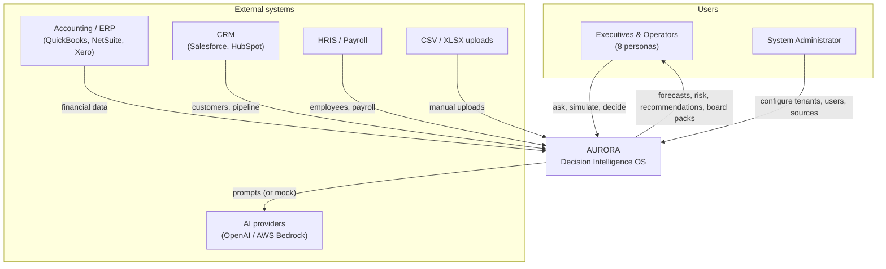
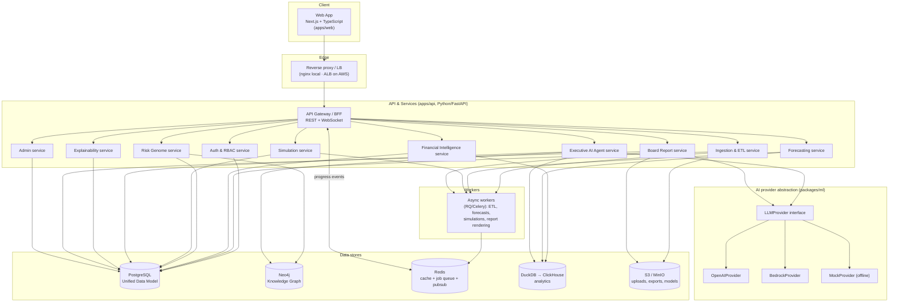
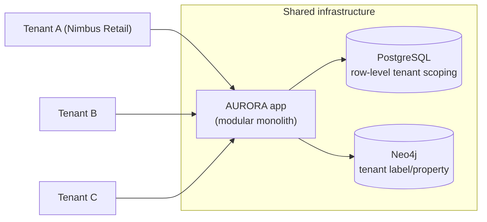
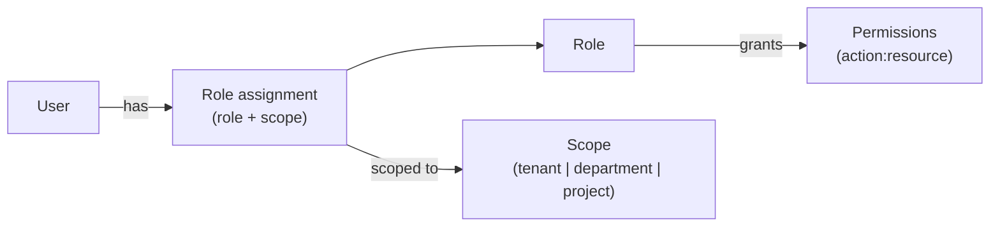
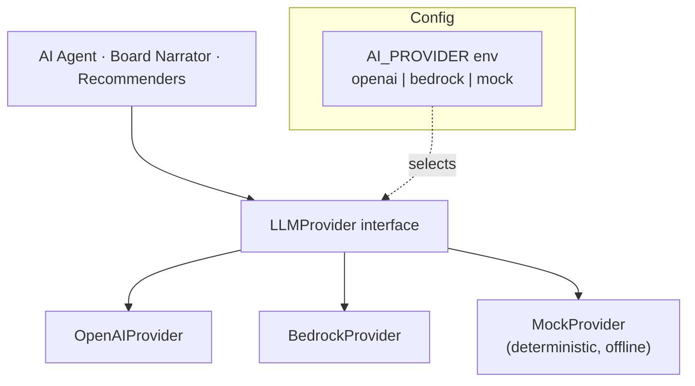
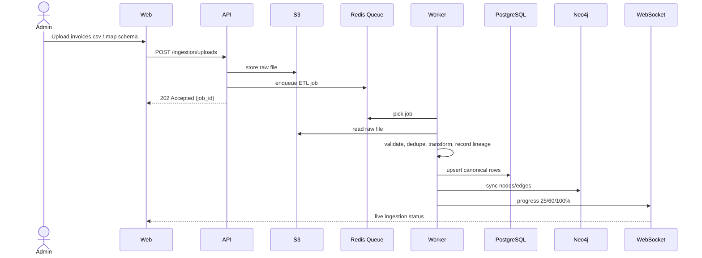
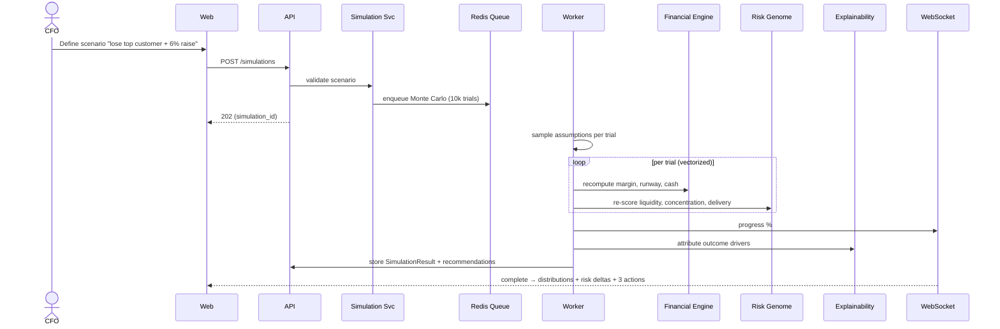
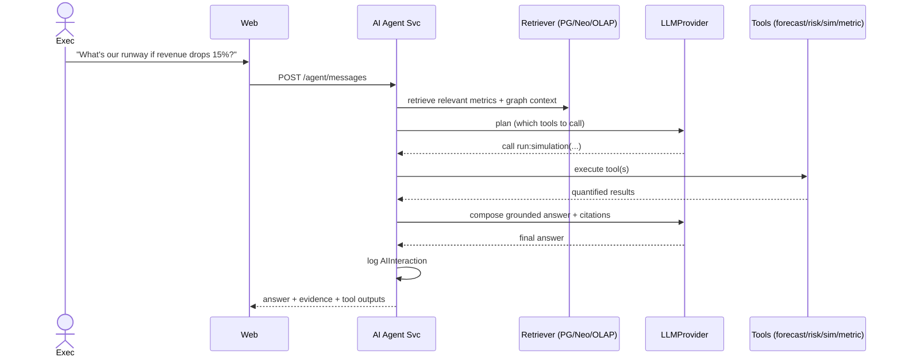
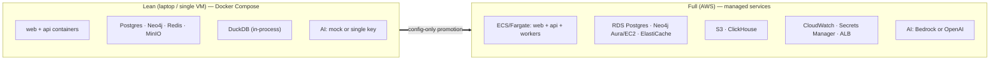

# AURORA — System Architecture

> **Document status:** Foundational architecture reference for all 12 modules.
>
> **Related:** [Overview & Vision](../00-overview-and-vision.md) ·
> [Folder Structure](folder-structure.md) · [Data Model](../data-model/data-model.md) ·
> [API Specification](../api/api-specification.md) ·
> [Financial, Risk & Simulation Models](financial-risk-simulation-models.md) ·
> [Deployment Guide](../deployment/deployment-guide.md)

---

## 1. Architectural goals & constraints

| Goal | Implication on the architecture |
|------|---------------------------------|
| Cross-domain digital twin | A shared canonical data model + a knowledge graph, not per-feature stores. |
| Explainable by default | Every compute path persists inputs, formula/version, and attributions. |
| Forward-looking | First-class forecasting, risk, and simulation services with job orchestration. |
| Multi-tenant SaaS | Tenant isolation enforced at the data layer and in every request context. |
| Lean-first, scale-ready | Same code runs on Docker Compose (laptop) and AWS (ECS/RDS) with config-only changes. |
| Provider-agnostic AI | A thin AI abstraction with OpenAI, Bedrock, and an **offline mock** implementation. |
| Secure | RBAC + row-level tenant scoping + audit logging on every mutation. |

**Non-goals (for now):** real-time streaming ingestion (batch/micro-batch is sufficient),
globally-distributed multi-region writes, and on-prem air-gapped deployment.

---

## 2. System context (C4 level 1)



AURORA is a single logical product that pulls from a company's operational systems and serves
its leadership. External AI providers are *optional* — the offline mock keeps the system fully
functional without them.

---

## 3. Container architecture (C4 level 2)



> **Modular monolith first.** Services above are *logical* modules inside one FastAPI
> application (a modular monolith) for the MVP — simpler to run and deploy. The boundaries are
> drawn so any module can later be extracted into its own service without changing its
> contracts. This is the "lean-first, scale-ready" principle in practice.

---

## 4. The 12 modules in detail

For each module: its responsibility, key components, primary data stores, and main inputs/outputs.

### Module 1 — Enterprise Data Integration Layer
- **Responsibility:** get external data in, cleanly and traceably.
- **Components:** upload handler (CSV/XLSX → S3), connector framework (accounting/CRM/HRIS
  adapters), schema-mapping UI/service, validation engine (type/range/referential checks),
  deduplication, ETL transforms, and a **lineage recorder**.
- **Stores:** raw files in S3/MinIO; staged + canonical rows in PostgreSQL; job state in Redis.
- **I/O:** in = files/connector pulls; out = validated rows in the data model + ingestion
  status events on a WebSocket channel.
- **Notes:** batch/micro-batch only. Each canonical row carries `source_id` + `lineage_ref`.

### Module 2 — Unified Company Data Model
- **Responsibility:** the canonical, multi-tenant schema all modules share.
- **Components:** SQLAlchemy models + Alembic migrations for the 21 entities; tenant-scoping
  mixins; repository layer.
- **Stores:** PostgreSQL (authoritative).
- **I/O:** read/write API used by every other module. Full spec in
  [Data Model](../data-model/data-model.md).

### Module 3 — Company Knowledge Graph
- **Responsibility:** represent and traverse relationships (dependencies, concentration).
- **Components:** graph sync (projects relational rows → Neo4j nodes/edges), Cypher query
  library, graph-derived metrics (centrality, concentration), and a graph API for the UI's
  React Flow view.
- **Stores:** Neo4j; sync checkpoints in PostgreSQL.
- **I/O:** in = canonical entities; out = dependency/impact queries used by Risk, Simulation,
  and the AI Agent.

### Module 4 — Financial Intelligence Engine
- **Responsibility:** compute the financial truth.
- **Components:** metric calculators (margins, burn, runway, variance, concentration, ROI,
  unit economics), period aggregation, and a metric registry (id → formula + version).
- **Stores:** reads PostgreSQL + analytics store; writes computed metric snapshots.
- **I/O:** out = metric series consumed by dashboard, forecasting, risk, reports.
- **Formulas:** [Financial, Risk & Simulation Models §2](financial-risk-simulation-models.md#2-financial-intelligence-formulas).

### Module 5 — Forecasting Engine
- **Responsibility:** project metrics forward with uncertainty.
- **Components:** model adapters (Prophet, statsmodels SARIMAX, driver regression), feature
  builder, backtesting/accuracy reporter, and a forecast store.
- **Stores:** analytics store for series; PostgreSQL for `Forecast` records + accuracy.
- **I/O:** in = historical metrics; out = `Forecast` (point + confidence interval) used by
  dashboard, simulation, risk, reports. Runs as async jobs.

### Module 6 — Enterprise Risk Genome
- **Responsibility:** continuously score 8 risk dimensions (0–100) with drivers + actions.
- **Components:** per-dimension scorers, a normalization layer (raw → 0–100), driver
  attribution, recommended-action generator, and `RiskSignal` persistence.
- **Stores:** PostgreSQL (`RiskSignal`), reads graph + financial metrics.
- **I/O:** out = the risk genome consumed by dashboard, agent, reports.
- **Scoring:** [Financial, Risk & Simulation Models §4](financial-risk-simulation-models.md#4-the-enterprise-risk-genome).

### Module 7 — Decision Simulation Engine
- **Responsibility:** Monte Carlo "what-if" over scenarios.
- **Components:** scenario parser (assumptions → parameter deltas), Monte Carlo runner
  (vectorized NumPy), per-trial recompute of finance + risk, and distribution summarizer.
- **Stores:** PostgreSQL (`Scenario`, `SimulationResult`); progress via Redis pub/sub → WS.
- **I/O:** in = scenario; out = outcome distributions + risk deltas + recommendations.
- **Design:** [Financial, Risk & Simulation Models §5](financial-risk-simulation-models.md#5-decision-simulation-engine-monte-carlo).

### Module 8 — Executive AI Agent
- **Responsibility:** natural-language Q&A and orchestration over the twin.
- **Components:** RAG retriever (over data model + graph + metric snapshots), tool router
  (forecast/risk/simulate/metric-lookup as callable tools), prompt templates, and the
  `AIInteraction` logger.
- **Stores:** PostgreSQL (`AIInteraction`), reads everything; uses the AI abstraction.
- **I/O:** in = user question; out = grounded answer + citations + optional tool results.
- **Abstraction:** [§8 AI Provider Abstraction](#8-ai-provider-abstraction).

### Module 9 — Explainability Layer
- **Responsibility:** make every output defensible.
- **Components:** metric explainers (formula + inputs), SHAP/feature-importance for ML
  outputs, and an evidence-trail assembler (links to source rows + lineage).
- **Stores:** reads metric/forecast/risk records + lineage; caches explanations.
- **I/O:** out = explanation objects attached to any metric/forecast/risk/recommendation.

### Module 10 — Executive Dashboard
- **Responsibility:** the command-center UI.
- **Components:** Next.js pages, KPI tiles, trend charts (Recharts/Plotly), the risk-genome
  panel, alert feed, and the embedded agent. See [UI/UX Plan](ui-ux-plan.md).
- **Stores:** none (consumes API).
- **I/O:** in = API + WebSocket; out = the executive experience.

### Module 11 — Board Report Generator
- **Responsibility:** assemble narrated, exportable board packs.
- **Components:** section composer (financials, forecast, risk, decisions), AI narrator,
  template/theme engine, and a PDF/slide renderer (worker job).
- **Stores:** PostgreSQL (`BoardReport`), exports to S3.
- **I/O:** in = live data + selected scenarios; out = reviewable, exportable report.

### Module 12 — Enterprise Admin Console
- **Responsibility:** the control plane.
- **Components:** tenant/workspace management, user & role admin, data-source registry &
  health, audit-log viewer, and (later) billing/usage.
- **Stores:** PostgreSQL (`Company`, `User`, `Role`, `AuditLog`, source registry).
- **I/O:** admin-only operations; emits audit entries.

---

## 5. Technology stack rationale

| Concern | Choice | Why this, not alternatives |
|---------|--------|----------------------------|
| Frontend framework | **Next.js (App Router) + TypeScript** | SSR/streaming for fast executive dashboards, mature ecosystem, first-class TS. vs. plain SPA: better data-fetching & routing. |
| Styling/UI | **Tailwind + shadcn/ui** | Consistent, themeable, accessible primitives; fast to build a dense terminal-style UI. vs. MUI: lighter, fully ownable components. |
| Charts | **Recharts (standard) + Plotly (advanced)** | Recharts covers 90% of KPI/trend needs simply; Plotly handles distributions/Monte Carlo fan charts. |
| Graph viz | **React Flow** | Purpose-built for interactive node/edge graphs (the knowledge-graph view). |
| Backend | **Python + FastAPI** | Python is where the ML/forecasting/SHAP ecosystem lives → no cross-language boundary for the analytical core. FastAPI gives async, typed, OpenAPI-native APIs + WebSockets. vs. Node: keeps ML in-process. |
| Validation/serialization | **Pydantic v2** | Typed request/response models, shared with OpenAPI generation. |
| ORM/migrations | **SQLAlchemy 2.0 + Alembic** | Mature, supports the tenant-scoping patterns we need. |
| Relational DB | **PostgreSQL** | Reliable, rich (JSONB, window funcs, RLS available), great for multi-tenant. |
| Graph DB | **Neo4j** | Best-in-class for relationship traversal/concentration analysis vs. doing recursive SQL. |
| Cache/queue/pubsub | **Redis (+ RQ or Celery)** | One dependency for caching, async jobs, and WebSocket fan-out. RQ for simplicity; Celery if routing/retries grow. |
| Analytics store | **DuckDB → ClickHouse** | DuckDB = zero-ops columnar analytics on a laptop; swap to ClickHouse at scale behind the same query layer. |
| Object storage | **S3 / MinIO** | S3 API everywhere; MinIO gives the identical API locally. |
| AI/LLM | **Provider abstraction (OpenAI/Bedrock/mock)** | Avoid vendor lock-in; enable offline dev/demo. |
| RAG/orchestration | **LangChain or LlamaIndex (thin usage)** | Reuse retrievers/tool plumbing; kept behind our own interfaces to stay swappable. |
| Classic ML | **scikit-learn, XGBoost** | Drivers/attribution, anomaly detection. |
| Time series | **Prophet, statsmodels** | Seasonality + interpretable forecasts with intervals. |
| Explainability | **SHAP** | Standard, model-agnostic attribution. |
| Infra (local) | **Docker Compose** | One command to run the whole stack. |
| Infra (cloud) | **AWS ECS/RDS/S3/CloudWatch (+ optional Terraform)** | Managed, matches the lean→scale path; Terraform for reproducibility. |
| CI/CD | **GitHub Actions** | Native to the repo; lint/test/build/deploy pipelines. |

---

## 6. Multi-tenancy model

AURORA is multi-tenant with **shared-schema, row-level isolation** (a `tenant_id`/`company_id`
on every business table), chosen for operational simplicity at MVP scale, with a clear path to
stronger isolation later.



**Enforcement layers (defense in depth):**
1. **Auth context.** Every authenticated request resolves to a `tenant_id` from the JWT/session.
2. **Repository scoping.** A base repository injects `WHERE company_id = :tenant` into every
   query; models inherit a `TenantScopedMixin`. Cross-tenant queries are impossible through the
   normal data path.
3. **Optional Postgres RLS.** Row-Level Security policies as a backstop for direct DB access.
4. **Graph scoping.** Neo4j nodes carry a `tenant_id` property; all Cypher templates filter on it.
5. **Object storage.** S3 keys are namespaced `{(tenant_id)}/...`; signed URLs are tenant-scoped.

**Isolation upgrade path:** shared-schema → schema-per-tenant → database-per-tenant for large
or regulated customers, without changing application contracts (only the connection/router).

---

## 7. Security, RBAC & multi-tenancy

### 7.1 Authentication
- Email/password with bcrypt/argon2 hashing for MVP; pluggable to SSO/OIDC later.
- **JWT access tokens** (short-lived) + refresh tokens; tokens carry `user_id`, `tenant_id`,
  `roles`, and `scopes`.
- All traffic over TLS (terminated at the proxy/ALB).

### 7.2 Authorization (RBAC)
Permissions are `(action, resource)` pairs (e.g., `read:financials`, `run:simulation`,
`approve:board_report`, `manage:users`). Roles bundle permissions; users hold roles **scoped**
to the whole tenant or to specific departments/projects.



**Permission matrix (illustrative subset):**

| Permission | CEO | CFO | COO | Strategy | Analyst | Ops Mgr | Dept Head | Admin |
|------------|:---:|:---:|:---:|:--------:|:-------:|:-------:|:---------:|:-----:|
| `read:financials` | ✅ | ✅ | partial | ✅ | ✅ | scoped | scoped | ❌ |
| `write:financials` | ❌ | ✅ | ❌ | ❌ | ✅ | ❌ | ❌ | ❌ |
| `read:operations` | ✅ | ✅ | ✅ | ✅ | ✅ | scoped | scoped | ❌ |
| `read:graph` | ✅ | ✅ | ✅ | ✅ | ✅ | scoped | scoped | ❌ |
| `run:forecast` | ✅ | ✅ | ✅ | ✅ | ✅ | ❌ | ❌ | ❌ |
| `run:simulation` | ✅ | ✅ | ✅ | ✅ | ❌ | ❌ | ❌ | ❌ |
| `use:ai_agent` | ✅ | ✅ | ✅ | ✅ | ✅ | scoped | scoped | ❌ |
| `create:board_report` | ✅ | ✅ | ❌ | ✅ | ✅ | ❌ | ❌ | ❌ |
| `approve:board_report` | ✅ | ✅ | ❌ | ❌ | ❌ | ❌ | ❌ | ❌ |
| `manage:data_sources` | ❌ | partial | ❌ | ❌ | ✅ | ❌ | ❌ | ✅ |
| `manage:users` | ❌ | ❌ | ❌ | ❌ | ❌ | ❌ | ❌ | ✅ |
| `view:audit_log` | ✅ | ✅ | ❌ | ❌ | ❌ | ❌ | ❌ | ✅ |

*"scoped"/"partial" = limited to assigned departments/projects or to non-sensitive fields.*

### 7.3 Enforcement
- A FastAPI dependency resolves the request's `AuthContext` (user, tenant, roles, scopes).
- Route guards declare required permission(s); a policy check runs before the handler.
- Repositories apply both tenant and scope filters.
- **Every mutation writes an `AuditLog` entry** (who, what, when, before/after, request id).

### 7.4 Data protection
- Secrets via environment/secret manager (never in code) — see
  [Deployment Guide](../deployment/deployment-guide.md#secrets-handling).
- Sensitive fields (e.g., salary) encryptable at rest; PII access is permission-gated and audited.
- Signed, expiring URLs for object access.

---

## 8. AI provider abstraction

A core principle: **AURORA must run, develop, and demo with no external AI keys.** The agent
and narrator depend only on an interface.



**Interface (conceptual):**

```python
class LLMProvider(Protocol):
    def complete(self, prompt: str, *, system: str | None = None,
                 temperature: float = 0.2, max_tokens: int = 1024) -> str: ...
    def chat(self, messages: list[Message], *, tools: list[Tool] | None = None) -> ChatResult: ...
    def embed(self, texts: list[str]) -> list[list[float]]: ...
```

- **Selection** is config-driven (`AI_PROVIDER=openai|bedrock|mock`); default `mock` when no key.
- **OpenAIProvider / BedrockProvider** wrap their SDKs and normalize tool-calling + token usage.
- **MockProvider** returns deterministic, templated responses (and hash-based pseudo-embeddings)
  so retrieval, tool routing, and the full UX work offline and in CI.
- **Cross-cutting:** retries/backoff, timeouts, token-usage logging, prompt/version tagging,
  and PII redaction live in a wrapper applied to every provider.
- Consumers (agent, narrator) never import a vendor SDK directly — only `LLMProvider`. This is
  what enables [no-key local dev](../deployment/deployment-guide.md) and provider swaps.

---

## 9. Key request & data-flow paths

### 9.1 Data ingestion (async, with live status)



### 9.2 Decision simulation (the signature flow)



### 9.3 Executive AI question (RAG + tools)



---

## 10. Cross-cutting concerns

| Concern | Approach |
|---------|----------|
| **Configuration** | 12-factor; typed settings (Pydantic `BaseSettings`) from env; `.env.example` documents every var. |
| **Async jobs** | Redis-backed queue; idempotent jobs keyed by `(tenant, type, hash)`; retries with backoff. |
| **Real-time** | WebSocket channels for ingestion status & simulation progress, fanned out via Redis pub/sub. |
| **Observability** | Structured JSON logs with `request_id`/`tenant_id`; metrics + health endpoints; CloudWatch in cloud. |
| **Error handling** | Consistent error envelope (see [API §errors](../api/api-specification.md#5-error-model)); no leakage of internals. |
| **Caching** | Redis for expensive metric/forecast reads, keyed by `(tenant, metric, period, version)`; invalidated on ingest. |
| **Versioning** | Metric/model/prompt versions stored with outputs for reproducibility & explainability. |
| **Testing** | Unit (calculators/scorers), contract (API/OpenAPI), and E2E against the demo tenant using the mock AI provider. |
| **Audit** | Append-only `AuditLog` on every mutation and sensitive read. |

---

## 11. Lean-first → full infrastructure strategy

Same codebase, two deployment postures, switched by configuration only.



| Capability | Lean | Full |
|------------|------|------|
| Compute | Docker Compose containers | ECS/Fargate services |
| Relational | Postgres container | RDS PostgreSQL |
| Graph | Neo4j container | Neo4j Aura / EC2 |
| Cache/queue | Redis container | ElastiCache |
| Analytics | DuckDB in-process | ClickHouse |
| Objects | MinIO | S3 |
| Secrets | `.env` | AWS Secrets Manager |
| Observability | container logs | CloudWatch |
| AI | mock / single key | Bedrock / OpenAI |

Details and manifests are designed in the
[Deployment Guide](../deployment/deployment-guide.md).

---

## 12. Architecture decision records (summary)

| ID | Decision | Status | Rationale |
|----|----------|--------|-----------|
| ADR-001 | Modular monolith (not microservices) for MVP | Accepted | Lower ops cost; clean module boundaries keep extraction cheap later. |
| ADR-002 | Python/FastAPI backend | Accepted | Keeps ML/forecasting/SHAP in-process; async + typed APIs. |
| ADR-003 | PostgreSQL + Neo4j (polyglot) | Accepted | Relational truth + efficient relationship traversal. |
| ADR-004 | Shared-schema row-level multi-tenancy | Accepted | Simple at MVP; clear upgrade path to schema/DB-per-tenant. |
| ADR-005 | DuckDB → ClickHouse analytics | Accepted | Zero-ops locally; scalable later behind one query layer. |
| ADR-006 | AI provider abstraction + offline mock | Accepted | No vendor lock-in; full offline dev/demo/CI. |
| ADR-007 | Redis for cache + queue + pubsub | Accepted | One dependency covers three needs at MVP scale. |
| ADR-008 | Async jobs for ETL/forecast/simulation/reports | Accepted | Long-running, bursty work must not block requests. |
| ADR-009 | Knowledge graph stays an in-memory projection rebuilt from Postgres at boot; Neo4j deferred | Accepted 2026-07-20 | The graph is derived data (rebuild ≈ seconds at current scale) and every task rebuilds identically, so durability adds ops cost without correctness gain. Revisit when graph size makes boot rebuilds slow (>30s) or cross-task graph mutations appear. |

---

## 13. Where to go next
- The repository layout that realizes this architecture → [Folder Structure](folder-structure.md)
- The schema the data layer implements → [Data Model](../data-model/data-model.md)
- The contracts the API exposes → [API Specification](../api/api-specification.md)
- The math inside the engines → [Financial, Risk & Simulation Models](financial-risk-simulation-models.md)
- How it runs → [Deployment Guide](../deployment/deployment-guide.md)
