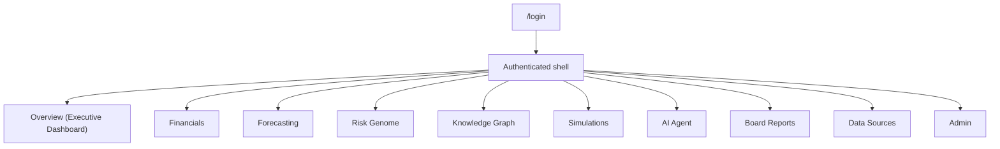

# AURORA — UI/UX Plan

> **Document status:** Foundational design reference for `apps/web` and `packages/ui`. Defines
> the page inventory, dashboard layout, key views, component plan, and design system.
>
> **Related:** [System Architecture](system-architecture.md) ·
> [API Specification](../api/api-specification.md) ·
> [Folder Structure](folder-structure.md) ·
> [Financial, Risk & Simulation Models](financial-risk-simulation-models.md)

---

## 1. Design philosophy

AURORA's UI is a **decision command center**, not a passive BI tool. Inspiration:
**Bloomberg Terminal** (information density, dark, fast, keyboard-driven) tempered with modern,
calm SaaS clarity so executives — not just analysts — feel at home.

**Principles**
1. **Signal over chrome.** Numbers and trends dominate; decoration recedes.
2. **Always answer "so what?"** Every metric pairs with a trend, a target/delta, and a path to
   *why* (explainability) and *what to do* (recommendations).
3. **Dense but scannable.** High information density with strong visual hierarchy and whitespace
   rhythm so it never feels cluttered.
4. **Forward-looking by default.** Forecasts, risk, and "what-if" are first-class, not buried.
5. **Explainable in one click.** Any figure exposes an "Explain" affordance.
6. **Dark-first.** A professional dark theme is the default; light theme supported.
7. **Responsive priority:** desktop-first (executive workstation), graceful down to tablet;
   read-only summaries usable on mobile.
8. **Accessible:** WCAG 2.1 AA — contrast, keyboard nav, focus states, ARIA, reduced-motion.

---

## 2. Information architecture & navigation



**Shell layout:** persistent **left sidebar** (primary nav, collapsible to icons), a **top bar**
(global search/command palette, workspace switcher, period selector, notifications, profile), and
a **dockable AI Agent** panel (right drawer) reachable from anywhere via `⌘K → Ask AURORA`.

**Nav visibility is RBAC-aware** — items render only if the user holds the permission
([Architecture §7.2](system-architecture.md#72-authorization-rbac)); e.g., Admin appears only for
`manage:users`, Simulations only for `run:simulation`.

---

## 3. Page inventory

| # | Route | Page | Primary module(s) | Key permission |
|---|-------|------|-------------------|----------------|
| 1 | `/login` | Sign in | 12 | public |
| 2 | `/overview` | Executive Dashboard | 4,5,6,8,10 | authenticated |
| 3 | `/financials` | Financial Intelligence | 4 | `read:financials` |
| 4 | `/forecasting` | Forecast Explorer | 5 | `read:financials` |
| 5 | `/risk` | Risk Genome detail | 6 | `read:financials`/`read:operations` |
| 6 | `/graph` | Knowledge Graph explorer | 3 | `read:graph` |
| 7 | `/simulations` | Scenario builder + results | 7 | `run:simulation` |
| 8 | `/agent` | AI Agent (full page) | 8 | `use:ai_agent` |
| 9 | `/reports` | Board Report builder | 11 | `create:board_report` |
| 10 | `/data` | Data Sources & Ingestion | 1 | `manage:data_sources` |
| 11 | `/admin` | Users, Roles, Audit | 12 | `manage:users`/`view:audit_log` |
| 12 | `/settings` | Workspace & profile | 12 | authenticated |
| 13 | `*` | Explain overlay (modal, route-agnostic) | 9 | inherits source perm |

---

## 4. Executive Dashboard layout (`/overview`)

The flagship screen — a single scroll that answers "How are we, what's coming, what's risky,
what should I do?" Sections top-to-bottom:

```text
┌──────────────────────────────────────────────────────────────────────────┐
│ TOP BAR: ⌘K search · Workspace: Nimbus ▾ · Period: Jun 2026 ▾ · 🔔 · 👤   │
├───────────┬──────────────────────────────────────────────────────────────┤
│           │ A) KPI STRIP  (6 tiles)                                         │
│  S        │ [Revenue MTD ▲17%] [Gross Margin 41.2%] [Op Margin 8.9%]        │
│  I        │ [Net Burn $4.2M] [Cash Runway 5.4mo ▼] [Overall Risk 58 ▲]     │
│  D        ├──────────────────────────────────────────────────────────────┤
│  E        │ B) REVENUE & FORECAST            │ C) RISK GENOME              │
│  B        │   line + shaded CI fan chart      │   8-axis radar / gauges     │
│  A        │   (actuals → forecast)            │   color-coded by severity   │
│  R        ├───────────────────────────────────┴──────────────────────────┤
│           │ D) CASH & RUNWAY            │ E) ALERTS & ANOMALIES            │
│           │   bar + runway line          │   ranked feed (expense spike,   │
│           │                               │   concentration creep, …)       │
│           ├──────────────────────────────┴──────────────────────────────┤
│           │ F) TOP RECOMMENDATIONS (ranked, each → Explain / Simulate)     │
│           ├──────────────────────────────────────────────────────────────┤
│           │ G) ASK AURORA  (inline agent prompt → opens agent drawer)      │
└───────────┴──────────────────────────────────────────────────────────────┘
```

| Section | Content | Source | Interactions |
|---------|---------|--------|--------------|
| A — KPI strip | 6 headline KPIs w/ YoY delta + spark | `GET /metrics/overview` | click → drill to Financials; "Explain" |
| B — Revenue & forecast | actuals + forecast fan (80% CI) | `/metrics/revenue/series` + `/forecasts` | toggle metric; hover tooltips |
| C — Risk genome | 8 dimensions, severity-colored | `GET /risk/genome` | click axis → `/risk/{dimension}` |
| D — Cash & runway | cash bars + runway line | `/financials/cash` | hover; "Explain" |
| E — Alerts | anomalies/threshold breaches | risk + ingestion | dismiss/snooze; jump to source |
| F — Recommendations | ranked actions + impact | `recommendation` feed | Accept/Dismiss; "Simulate this" |
| G — Ask AURORA | natural-language prompt | `POST /agent/messages` | opens agent drawer with context |

**Personalization:** the dashboard respects role + scope (a Department Head sees their
department's slice); tiles a user can't access are hidden, not greyed.

---

## 5. Key views in depth

### 5.1 Risk Genome (`/risk`)
- **Hero:** the 8-dimension visualization (radar + a row of 0–100 gauges), each colored by
  severity band ([Models §4.1](financial-risk-simulation-models.md#41-scoring-framework)).
- **Drill:** selecting a dimension opens a panel with the **score, drivers (ranked bar of
  contributions), plain-language explanation, and recommended actions** — straight from
  [`/risk/genome/{dimension}`](../api/api-specification.md#66-risk-genome-module-6).
- **Trend:** small multiples of each dimension over time (concentration creep is visible).

### 5.2 Knowledge Graph explorer (`/graph`)
- **Canvas:** React Flow interactive graph; nodes typed by color/icon (Customer, Vendor,
  Product, Department, Project, Employee).
- **Controls:** filter by node type, depth slider (1–3 hops), search to focus a node, layout
  toggle (force/hierarchical).
- **Impact mode:** select a node → highlights its dependency subtree and shows
  **revenue-at-risk** from [`/graph/impact/{node_id}`](../api/api-specification.md#64-knowledge-graph-module-3).
- **Side panel:** selected entity's details + "Simulate failure/loss of this" shortcut into the
  simulator.

### 5.3 Simulator (`/simulations`)
A **two-pane** workspace:

```text
┌── Scenario Builder ─────────────┐   ┌── Results ───────────────────────────┐
│ Name, horizon, # trials          │   │ Distribution (Plotly histogram/fan)   │
│ Shocks:                          │   │ Summary: mean · p5 · p50 · p95 ·      │
│  + Customer churn  [Continental] │   │          P(runway<3mo)                │
│  + Expense change  [ENG +6%]     │   │ Risk deltas (Δ per dimension)         │
│ Uncertain drivers (distributions)│   │ Ranked recommendations                │
│ [ Run simulation ]  ▸ progress % │   │ "Add to board report" · "Explain"     │
└──────────────────────────────────┘   └───────────────────────────────────────┘
```
- Live progress via the `simulation:{id}` [WebSocket channel](../api/api-specification.md#7-websocket-channels).
- Results use **Plotly** for distributions/fan charts; recommendations link to Explain.

### 5.4 Forecast Explorer (`/forecasting`)
- Metric selector; actuals + forecast with the **confidence band**; accuracy chips (MAPE,
  coverage); method badge (ensemble). "Explain" opens feature-importance
  ([Models §6.2](financial-risk-simulation-models.md#62-feature-attribution-ml-outputs)).

### 5.5 AI Agent (drawer + `/agent`)
- Chat transcript with **streamed** answers, **inline citations** (chips linking to the metric/
  simulation referenced), and **tool-call cards** ("Ran simulation → view results").
- Suggested prompts seeded by current context (e.g., on `/risk` it suggests risk questions).
- Works fully with the **mock provider** when no key is set
  ([Architecture §8](system-architecture.md#8-ai-provider-abstraction)).

### 5.6 Board Report builder (`/reports`)
- Left: section checklist + drag-to-reorder; Right: **live preview** of the narrated pack.
- Status workflow (draft → in_review → approved → published); **Export PDF** (signed URL).

### 5.7 Data Sources (`/data`)
- Source cards with health/last-sync; upload dropzone with **schema-mapping** step; ingestion
  job list with live progress (`ingestion:{job_id}` channel) and rejected-row drill-down.

### 5.8 Admin (`/admin`)
- Users table (roles, scopes, status), role/permission editor, and the **audit log** viewer
  (cursor-paginated, filterable).

### 5.9 Explain overlay (global)
- A consistent modal/drawer invoked by any "Explain" affordance: shows **formula + inputs**
  (deterministic metrics) or **feature attribution + evidence trail** (ML outputs), per
  [Models §6](financial-risk-simulation-models.md#6-explainability-layer).

---

## 6. Component plan

Built in [`packages/ui`](folder-structure.md#41-packagesui--react-component-library) on
**shadcn/ui** primitives; composed in `apps/web`.

### 6.1 Primitives (shadcn/ui)
Button, Input, Select, Dialog, Drawer/Sheet, Tabs, Card, Table, Badge, Tooltip, Popover,
DropdownMenu, Toast, Skeleton, Command (⌘K palette), ScrollArea, Avatar, Switch, Slider.

### 6.2 AURORA composite components

| Component | Built on | Used in |
|-----------|----------|---------|
| `KpiTile` | Card + sparkline + delta badge | dashboard KPI strip |
| `TrendChart` | **Recharts** line/area | revenue, cash, metric series |
| `ForecastFanChart` | **Recharts/Plotly** (line + shaded CI) | dashboard B, forecasting |
| `DistributionChart` | **Plotly** histogram/violin | simulator results |
| `RiskGenomeRadar` | **Recharts** radar + gauge set | dashboard C, `/risk` |
| `RiskDimensionCard` | Card + driver bars | `/risk` drill |
| `GraphCanvas` | **React Flow** wrapper | `/graph` |
| `EntityInspector` | Drawer + Table | graph/simulation side panels |
| `ScenarioBuilder` | Form + dynamic shock rows | `/simulations` |
| `RecommendationCard` | Card + impact + actions | dashboard F, results |
| `AgentChat` | message list + streaming + tool cards | agent drawer/page |
| `ExplainPanel` | Drawer + formula/attribution view | global Explain |
| `DataTable` | TanStack Table + Table | lists (invoices, users, audit) |
| `IngestionJobCard` | Card + progress + error drill | `/data` |
| `PeriodPicker` / `WorkspaceSwitcher` | Popover/Select | top bar |
| `ReportPreview` | section renderer | `/reports` |

### 6.3 Charting strategy
- **Recharts** for standard, fast KPI/trend/radar visuals (most of the app).
- **Plotly** reserved for statistically rich visuals (Monte Carlo distributions, fan charts,
  sensitivity) where interactivity/precision matters.
- Shared chart theming tokens so both libraries match the design system.

### 6.4 State & data
- Server state via **TanStack Query** (caching, background refresh) against the typed client in
  [`packages/types`](folder-structure.md#43-packagestypes--shared-typescript-types--api-client).
- Light client state via Zustand/Context (UI prefs, drawer state, period selection).
- **WebSocket hooks** (`useJobProgress`) subscribe to ingestion/simulation channels.

---

## 7. Design system

### 7.1 Color (dark-first; tokens in the Tailwind preset)

| Token | Dark | Light | Use |
|-------|------|-------|-----|
| `bg/base` | `#0B0E14` | `#F7F8FA` | app background |
| `bg/surface` | `#141925` | `#FFFFFF` | cards/panels |
| `bg/elevated` | `#1C2333` | `#FFFFFF` | popovers/modals |
| `border` | `#26304A` | `#E3E7EE` | dividers/outlines |
| `text/primary` | `#E6EAF2` | `#0B0E14` | headings/values |
| `text/muted` | `#8A93A6` | `#5B6473` | labels/secondary |
| `brand/primary` | `#3B82F6` | `#2563EB` | primary actions, links |
| `brand/accent` | `#22D3EE` | `#0891B2` | highlights, focus |

**Semantic (status & severity)** — consistent across charts and badges:

| Token | Hex | Meaning |
|-------|-----|---------|
| `positive` | `#22C55E` | good / up / on-track |
| `warning` | `#F59E0B` | caution / moderate risk |
| `negative` | `#EF4444` | bad / down / breach |
| `info` | `#3B82F6` | neutral info |
| risk `low` → `critical` | `#22C55E` → `#EAB308` → `#F97316` → `#EF4444` | risk-genome severity ramp |

Charts use a categorical palette derived from brand/accent + semantic colors, colorblind-checked.

### 7.2 Typography
- **UI font:** Inter (system fallback). **Numeric/tabular:** a monospaced or tabular-figure
  variant (e.g., `Roboto Mono`/Inter tabular nums) so columns of figures align — important for a
  terminal feel.

| Style | Size / line-height | Weight | Use |
|-------|--------------------|--------|-----|
| Display | 32 / 40 | 700 | page titles |
| H1 | 24 / 32 | 600 | section headers |
| H2 | 20 / 28 | 600 | card titles |
| Body | 14 / 20 | 400 | default text |
| Small | 12 / 16 | 400 | labels/captions |
| KPI value | 28 / 34 | 700, tabular | KPI tiles |
| Mono/num | 13 / 18 | 500, tabular | tables, figures |

### 7.3 Spacing, radius, elevation
- **Spacing scale (px):** 2, 4, 8, 12, 16, 24, 32, 48 (Tailwind defaults) — 8px base rhythm.
- **Radius:** `sm 6px`, `md 10px` (cards), `lg 16px` (modals); pills fully rounded.
- **Elevation:** subtle, low-opacity shadows in light; in dark, elevation via `bg/elevated` +
  hairline borders rather than heavy shadows.
- **Density mode:** a "comfortable/compact" toggle; compact tightens table/row padding for
  analyst-heavy screens.

### 7.4 Iconography & motion
- **Icons:** Lucide (line icons) for crisp, consistent affordances.
- **Motion:** fast and purposeful (120–200ms ease-out) for drawers, tooltips, chart transitions;
  honor `prefers-reduced-motion`. Loading uses skeletons, not spinners, where layout is known.

### 7.5 Accessibility checklist
- AA contrast on text and semantic colors (severity never conveyed by color alone — pair with
  label/icon).
- Full keyboard nav incl. ⌘K palette; visible focus rings (`brand/accent`).
- ARIA roles for charts (with data-table fallback), live regions for streaming agent answers and
  job progress.

---

## 8. Cross-cutting UX patterns
- **Explainability everywhere:** an "Explain" affordance on metrics, forecasts, risk scores, and
  recommendations → the global Explain overlay.
- **From insight to action:** risk/alert/recommendation cards offer "Simulate this" → prefilled
  scenario, and "Add to board report."
- **Live feedback:** long operations (ingest, forecast, simulate, render) always show progress
  via WebSocket, never a frozen screen.
- **Empty/loading/error states** designed for every data view (skeletons; friendly empty states
  guiding to "connect a data source"; error toasts using the API error envelope).

---

## 9. Where to go next
- The data each view binds to → [API Specification](../api/api-specification.md)
- The numbers visualized → [Financial, Risk & Simulation Models](financial-risk-simulation-models.md)
- Where components live → [Folder Structure](folder-structure.md)
- What ships first → [MVP Scope](../roadmap/mvp-scope.md)
