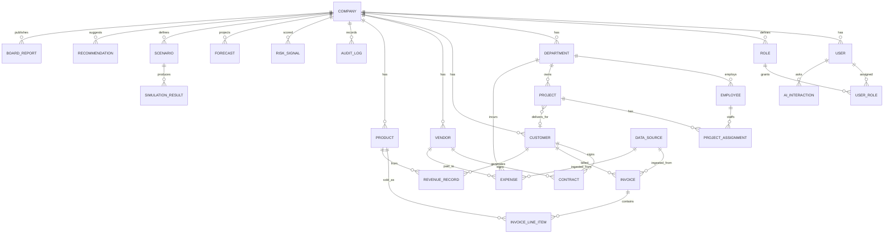
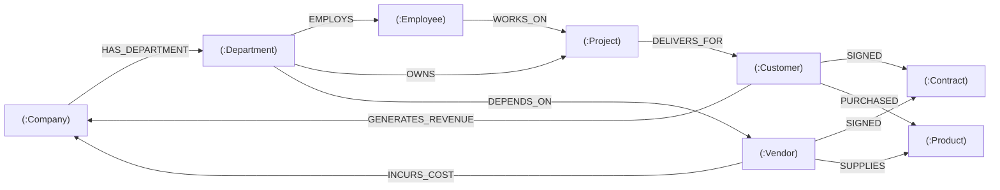

# AURORA — Unified Company Data Model

> **Document status:** Foundational. Defines the canonical schema (Module 2) every other
> module reads from: entity catalog, ERD, PostgreSQL DDL, the Neo4j graph model, and the
> analytics layer.
>
> **Related:** [System Architecture](../architecture/system-architecture.md) ·
> [Demo Dataset](demo-dataset-spec.md) · [API Specification](../api/api-specification.md) ·
> [Financial, Risk & Simulation Models](../architecture/financial-risk-simulation-models.md)

---

## 1. Modeling principles

1. **Tenant isolation first.** Every business table carries `company_id` (the tenant key) and
   is filtered on it in every query. See
   [Architecture §Multi-tenancy](../architecture/system-architecture.md#6-multi-tenancy-model).
2. **UUID primary keys** (`uuid` / `gen_random_uuid()`) — safe to expose, merge, and shard.
3. **Auditability.** `created_at`, `updated_at` everywhere; mutations also write `audit_log`.
4. **Lineage.** Ingested rows reference their `data_source_id` and a `lineage_ref`.
5. **Money as integers.** All monetary amounts stored in **minor units (cents)** as `BIGINT`
   plus a `currency` code, to avoid floating-point drift. (Docs show decimals for readability.)
6. **Soft enums via `CHECK` + lookup** where values are stable; `status` columns documented.
7. **Time-series friendliness.** Financial facts (`invoice`, `expense`, `revenue_record`) are
   modeled to roll up cleanly into the [analytics layer](#6-analytics-layer-duckdb--clickhouse).

> **Conventions in DDL below:** PostgreSQL 15+, `pgcrypto` for `gen_random_uuid()`. Indexes are
> declared after each table. `company_id` FKs all reference `company(id)`.

---

## 2. Entity catalog

21 core entities across five groups. (Supporting tables — line items, role assignments, data
sources — are included in the DDL where needed.)

### Group A — Tenancy, identity & access
| Entity | Purpose | Key relationships |
|--------|---------|-------------------|
| **Company** | The tenant / workspace root. | owns everything |
| **User** | A person who logs in. | belongs to Company; has Role assignments |
| **Role** | A named bundle of permissions. | assigned to Users (scoped) |
| **AuditLog** | Immutable record of significant actions. | references User + Company |

### Group B — Organization & people
| Entity | Purpose | Key relationships |
|--------|---------|-------------------|
| **Department** | An org unit (e.g., Sales, Eng). | belongs to Company; has Employees; has budget |
| **Employee** | A worker (not necessarily a User). | belongs to Department; works on Projects |
| **Project** | A unit of work with budget/timeline. | belongs to Department; linked to Customer |

### Group C — Commercial entities
| Entity | Purpose | Key relationships |
|--------|---------|-------------------|
| **Customer** | A revenue source. | has Contracts, Invoices, RevenueRecords |
| **Vendor** | A supplier/cost source. | has Contracts, Expenses; supplies Products |
| **Product** | A product/service line. | sold to Customers; appears on invoice lines |
| **Contract** | An agreement with a Customer or Vendor. | links party ↔ obligations/revenue |

### Group D — Financial facts
| Entity | Purpose | Key relationships |
|--------|---------|-------------------|
| **Invoice** | A bill issued to a Customer (AR). | Customer; has line items (Products) |
| **Expense** | A cost paid to a Vendor (AP). | Vendor; Department |
| **RevenueRecord** | Recognized revenue for a period. | Customer; Product; period |

### Group E — Intelligence & decision artifacts
| Entity | Purpose | Key relationships |
|--------|---------|-------------------|
| **RiskSignal** | A scored risk-genome reading. | Company; optional entity ref; drivers |
| **Forecast** | A projection of a metric over time. | Company; metric; intervals |
| **Scenario** | A user-defined set of assumptions. | Company; created by User |
| **SimulationResult** | Output distribution of a simulation. | Scenario; metrics |
| **Recommendation** | A ranked actionable suggestion. | Company; source engine; evidence |
| **AIInteraction** | A logged agent question/answer. | User; tools used; citations |
| **BoardReport** | An assembled board pack. | Company; sections; status |

---

## 3. Entity-Relationship Diagram



*(The ERD shows principal relationships; full FKs are in the DDL. Several intelligence
entities also carry an optional polymorphic `entity_type/entity_id` to attach to any record.)*

---

## 4. PostgreSQL DDL

```sql
-- =====================================================================
-- AURORA Unified Company Data Model — PostgreSQL 15+
-- =====================================================================
CREATE EXTENSION IF NOT EXISTS pgcrypto;   -- gen_random_uuid()
CREATE EXTENSION IF NOT EXISTS pg_trgm;     -- fuzzy search on names
CREATE EXTENSION IF NOT EXISTS citext;      -- case-insensitive email

-- ---------- Group A: Tenancy, identity & access ----------------------

CREATE TABLE company (
    id              UUID PRIMARY KEY DEFAULT gen_random_uuid(),
    name            TEXT NOT NULL,
    slug            TEXT NOT NULL UNIQUE,            -- workspace handle
    industry        TEXT,
    fiscal_year_start_month SMALLINT NOT NULL DEFAULT 1
                    CHECK (fiscal_year_start_month BETWEEN 1 AND 12),
    base_currency   CHAR(3) NOT NULL DEFAULT 'USD',
    settings        JSONB NOT NULL DEFAULT '{}'::jsonb,
    plan            TEXT NOT NULL DEFAULT 'standard',
    status          TEXT NOT NULL DEFAULT 'active'
                    CHECK (status IN ('active','suspended','archived')),
    created_at      TIMESTAMPTZ NOT NULL DEFAULT now(),
    updated_at      TIMESTAMPTZ NOT NULL DEFAULT now()
);

CREATE TABLE app_user (
    id              UUID PRIMARY KEY DEFAULT gen_random_uuid(),
    company_id      UUID NOT NULL REFERENCES company(id) ON DELETE CASCADE,
    email           CITEXT NOT NULL,
    full_name       TEXT NOT NULL,
    password_hash   TEXT,                            -- null if SSO-only
    title           TEXT,                            -- e.g., "Chief Financial Officer"
    is_active       BOOLEAN NOT NULL DEFAULT TRUE,
    last_login_at   TIMESTAMPTZ,
    created_at      TIMESTAMPTZ NOT NULL DEFAULT now(),
    updated_at      TIMESTAMPTZ NOT NULL DEFAULT now(),
    UNIQUE (company_id, email)
);
CREATE INDEX idx_user_company ON app_user(company_id);

CREATE TABLE role (
    id              UUID PRIMARY KEY DEFAULT gen_random_uuid(),
    company_id      UUID NOT NULL REFERENCES company(id) ON DELETE CASCADE,
    name            TEXT NOT NULL,                   -- e.g., "CFO","Department Head"
    description     TEXT,
    permissions     JSONB NOT NULL DEFAULT '[]'::jsonb,  -- ["read:financials", ...]
    is_system       BOOLEAN NOT NULL DEFAULT FALSE,  -- seeded default roles
    created_at      TIMESTAMPTZ NOT NULL DEFAULT now(),
    UNIQUE (company_id, name)
);

-- A user holds a role, optionally scoped to a department or project.
CREATE TABLE user_role (
    id              UUID PRIMARY KEY DEFAULT gen_random_uuid(),
    company_id      UUID NOT NULL REFERENCES company(id) ON DELETE CASCADE,
    user_id         UUID NOT NULL REFERENCES app_user(id) ON DELETE CASCADE,
    role_id         UUID NOT NULL REFERENCES role(id) ON DELETE CASCADE,
    scope_type      TEXT NOT NULL DEFAULT 'tenant'
                    CHECK (scope_type IN ('tenant','department','project')),
    scope_id        UUID,                            -- null when scope_type='tenant'
    created_at      TIMESTAMPTZ NOT NULL DEFAULT now(),
    UNIQUE (user_id, role_id, scope_type, scope_id)
);
CREATE INDEX idx_user_role_user ON user_role(user_id);

CREATE TABLE data_source (
    id              UUID PRIMARY KEY DEFAULT gen_random_uuid(),
    company_id      UUID NOT NULL REFERENCES company(id) ON DELETE CASCADE,
    kind            TEXT NOT NULL                    -- 'file','accounting','crm','hris','api'
                    CHECK (kind IN ('file','accounting','crm','hris','api')),
    name            TEXT NOT NULL,
    config          JSONB NOT NULL DEFAULT '{}'::jsonb,  -- non-secret connection metadata
    status          TEXT NOT NULL DEFAULT 'connected'
                    CHECK (status IN ('connected','error','syncing','disabled')),
    last_synced_at  TIMESTAMPTZ,
    created_at      TIMESTAMPTZ NOT NULL DEFAULT now()
);
CREATE INDEX idx_data_source_company ON data_source(company_id);

CREATE TABLE audit_log (
    id              BIGINT GENERATED ALWAYS AS IDENTITY PRIMARY KEY,  -- append-only monotonic key
    company_id      UUID NOT NULL REFERENCES company(id) ON DELETE CASCADE,
    user_id         UUID REFERENCES app_user(id) ON DELETE SET NULL,
    action          TEXT NOT NULL,                   -- e.g., 'invoice.update'
    resource_type   TEXT NOT NULL,
    resource_id     UUID,
    request_id      TEXT,
    before          JSONB,
    after           JSONB,
    ip_address      INET,
    created_at      TIMESTAMPTZ NOT NULL DEFAULT now()
);
CREATE INDEX idx_audit_company_time ON audit_log(company_id, created_at DESC);
CREATE INDEX idx_audit_resource ON audit_log(resource_type, resource_id);

-- ---------- Group B: Organization & people --------------------------

CREATE TABLE department (
    id              UUID PRIMARY KEY DEFAULT gen_random_uuid(),
    company_id      UUID NOT NULL REFERENCES company(id) ON DELETE CASCADE,
    name            TEXT NOT NULL,
    code            TEXT,                            -- e.g., 'ENG','SALES'
    parent_id       UUID REFERENCES department(id) ON DELETE SET NULL,  -- org hierarchy
    head_employee_id UUID,                           -- FK added after employee exists
    annual_budget_cents BIGINT NOT NULL DEFAULT 0,
    cost_center     TEXT,
    created_at      TIMESTAMPTZ NOT NULL DEFAULT now(),
    updated_at      TIMESTAMPTZ NOT NULL DEFAULT now(),
    UNIQUE (company_id, name)
);
CREATE INDEX idx_department_company ON department(company_id);

CREATE TABLE employee (
    id              UUID PRIMARY KEY DEFAULT gen_random_uuid(),
    company_id      UUID NOT NULL REFERENCES company(id) ON DELETE CASCADE,
    department_id   UUID REFERENCES department(id) ON DELETE SET NULL,
    user_id         UUID REFERENCES app_user(id) ON DELETE SET NULL, -- if they also log in
    full_name       TEXT NOT NULL,
    title           TEXT,
    employment_type TEXT NOT NULL DEFAULT 'full_time'
                    CHECK (employment_type IN ('full_time','part_time','contractor')),
    annual_salary_cents BIGINT NOT NULL DEFAULT 0,
    currency        CHAR(3) NOT NULL DEFAULT 'USD',
    hire_date       DATE,
    termination_date DATE,
    status          TEXT NOT NULL DEFAULT 'active'
                    CHECK (status IN ('active','on_leave','terminated')),
    data_source_id  UUID REFERENCES data_source(id) ON DELETE SET NULL,
    created_at      TIMESTAMPTZ NOT NULL DEFAULT now(),
    updated_at      TIMESTAMPTZ NOT NULL DEFAULT now()
);
CREATE INDEX idx_employee_company ON employee(company_id);
CREATE INDEX idx_employee_dept ON employee(department_id);

ALTER TABLE department
    ADD CONSTRAINT fk_department_head
    FOREIGN KEY (head_employee_id) REFERENCES employee(id) ON DELETE SET NULL;

-- ---------- Group C: Commercial entities ----------------------------

CREATE TABLE customer (
    id              UUID PRIMARY KEY DEFAULT gen_random_uuid(),
    company_id      UUID NOT NULL REFERENCES company(id) ON DELETE CASCADE,
    name            TEXT NOT NULL,
    segment         TEXT,                            -- e.g., 'enterprise','smb','retail'
    region          TEXT,
    industry        TEXT,
    status          TEXT NOT NULL DEFAULT 'active'
                    CHECK (status IN ('prospect','active','churned')),
    acquired_date   DATE,
    churn_date      DATE,
    data_source_id  UUID REFERENCES data_source(id) ON DELETE SET NULL,
    created_at      TIMESTAMPTZ NOT NULL DEFAULT now(),
    updated_at      TIMESTAMPTZ NOT NULL DEFAULT now()
);
CREATE INDEX idx_customer_company ON customer(company_id);
CREATE INDEX idx_customer_name_trgm ON customer USING gin (name gin_trgm_ops);

CREATE TABLE vendor (
    id              UUID PRIMARY KEY DEFAULT gen_random_uuid(),
    company_id      UUID NOT NULL REFERENCES company(id) ON DELETE CASCADE,
    name            TEXT NOT NULL,
    category        TEXT,                            -- e.g., 'logistics','saas','materials'
    region          TEXT,
    criticality     TEXT NOT NULL DEFAULT 'standard'
                    CHECK (criticality IN ('critical','standard','low')),
    status          TEXT NOT NULL DEFAULT 'active'
                    CHECK (status IN ('active','inactive')),
    data_source_id  UUID REFERENCES data_source(id) ON DELETE SET NULL,
    created_at      TIMESTAMPTZ NOT NULL DEFAULT now(),
    updated_at      TIMESTAMPTZ NOT NULL DEFAULT now()
);
CREATE INDEX idx_vendor_company ON vendor(company_id);

CREATE TABLE product (
    id              UUID PRIMARY KEY DEFAULT gen_random_uuid(),
    company_id      UUID NOT NULL REFERENCES company(id) ON DELETE CASCADE,
    name            TEXT NOT NULL,
    sku             TEXT,
    line            TEXT,                            -- product line/family
    unit_price_cents BIGINT NOT NULL DEFAULT 0,
    unit_cost_cents BIGINT NOT NULL DEFAULT 0,       -- COGS per unit
    currency        CHAR(3) NOT NULL DEFAULT 'USD',
    status          TEXT NOT NULL DEFAULT 'active'
                    CHECK (status IN ('active','discontinued')),
    created_at      TIMESTAMPTZ NOT NULL DEFAULT now(),
    updated_at      TIMESTAMPTZ NOT NULL DEFAULT now(),
    UNIQUE (company_id, sku)
);
CREATE INDEX idx_product_company ON product(company_id);

CREATE TABLE contract (
    id              UUID PRIMARY KEY DEFAULT gen_random_uuid(),
    company_id      UUID NOT NULL REFERENCES company(id) ON DELETE CASCADE,
    party_type      TEXT NOT NULL CHECK (party_type IN ('customer','vendor')),
    customer_id     UUID REFERENCES customer(id) ON DELETE CASCADE,
    vendor_id       UUID REFERENCES vendor(id) ON DELETE CASCADE,
    title           TEXT NOT NULL,
    value_cents     BIGINT NOT NULL DEFAULT 0,       -- total contract value
    currency        CHAR(3) NOT NULL DEFAULT 'USD',
    start_date      DATE,
    end_date        DATE,
    renewal_type    TEXT CHECK (renewal_type IN ('auto','manual','none')),
    status          TEXT NOT NULL DEFAULT 'active'
                    CHECK (status IN ('draft','active','expired','terminated')),
    created_at      TIMESTAMPTZ NOT NULL DEFAULT now(),
    updated_at      TIMESTAMPTZ NOT NULL DEFAULT now(),
    CHECK ( (party_type='customer' AND customer_id IS NOT NULL)
         OR (party_type='vendor'   AND vendor_id   IS NOT NULL) )
);
CREATE INDEX idx_contract_company ON contract(company_id);
CREATE INDEX idx_contract_customer ON contract(customer_id);
CREATE INDEX idx_contract_vendor ON contract(vendor_id);

-- ---------- Group D: Financial facts --------------------------------

CREATE TABLE invoice (
    id              UUID PRIMARY KEY DEFAULT gen_random_uuid(),
    company_id      UUID NOT NULL REFERENCES company(id) ON DELETE CASCADE,
    customer_id     UUID NOT NULL REFERENCES customer(id) ON DELETE CASCADE,
    contract_id     UUID REFERENCES contract(id) ON DELETE SET NULL,
    invoice_number  TEXT NOT NULL,
    issue_date      DATE NOT NULL,
    due_date        DATE,
    paid_date       DATE,
    subtotal_cents  BIGINT NOT NULL DEFAULT 0,
    tax_cents       BIGINT NOT NULL DEFAULT 0,
    total_cents     BIGINT NOT NULL DEFAULT 0,
    currency        CHAR(3) NOT NULL DEFAULT 'USD',
    status          TEXT NOT NULL DEFAULT 'issued'
                    CHECK (status IN ('draft','issued','paid','overdue','void')),
    data_source_id  UUID REFERENCES data_source(id) ON DELETE SET NULL,
    lineage_ref     TEXT,
    created_at      TIMESTAMPTZ NOT NULL DEFAULT now(),
    updated_at      TIMESTAMPTZ NOT NULL DEFAULT now(),
    UNIQUE (company_id, invoice_number)
);
CREATE INDEX idx_invoice_company_date ON invoice(company_id, issue_date);
CREATE INDEX idx_invoice_customer ON invoice(customer_id);
CREATE INDEX idx_invoice_status ON invoice(company_id, status);

CREATE TABLE invoice_line_item (
    id              UUID PRIMARY KEY DEFAULT gen_random_uuid(),
    company_id      UUID NOT NULL REFERENCES company(id) ON DELETE CASCADE,
    invoice_id      UUID NOT NULL REFERENCES invoice(id) ON DELETE CASCADE,
    product_id      UUID REFERENCES product(id) ON DELETE SET NULL,
    description     TEXT,
    quantity        NUMERIC(14,2) NOT NULL DEFAULT 1,
    unit_price_cents BIGINT NOT NULL DEFAULT 0,
    amount_cents    BIGINT NOT NULL DEFAULT 0,
    created_at      TIMESTAMPTZ NOT NULL DEFAULT now()
);
CREATE INDEX idx_ili_invoice ON invoice_line_item(invoice_id);
CREATE INDEX idx_ili_product ON invoice_line_item(product_id);

CREATE TABLE expense (
    id              UUID PRIMARY KEY DEFAULT gen_random_uuid(),
    company_id      UUID NOT NULL REFERENCES company(id) ON DELETE CASCADE,
    vendor_id       UUID REFERENCES vendor(id) ON DELETE SET NULL,
    department_id   UUID REFERENCES department(id) ON DELETE SET NULL,
    contract_id     UUID REFERENCES contract(id) ON DELETE SET NULL,
    category        TEXT NOT NULL,                   -- 'payroll','cogs','marketing','rent',...
    description     TEXT,
    amount_cents    BIGINT NOT NULL DEFAULT 0,
    currency        CHAR(3) NOT NULL DEFAULT 'USD',
    expense_date    DATE NOT NULL,
    is_recurring    BOOLEAN NOT NULL DEFAULT FALSE,
    data_source_id  UUID REFERENCES data_source(id) ON DELETE SET NULL,
    lineage_ref     TEXT,
    created_at      TIMESTAMPTZ NOT NULL DEFAULT now(),
    updated_at      TIMESTAMPTZ NOT NULL DEFAULT now()
);
CREATE INDEX idx_expense_company_date ON expense(company_id, expense_date);
CREATE INDEX idx_expense_vendor ON expense(vendor_id);
CREATE INDEX idx_expense_dept ON expense(department_id);
CREATE INDEX idx_expense_category ON expense(company_id, category);

CREATE TABLE revenue_record (
    id              UUID PRIMARY KEY DEFAULT gen_random_uuid(),
    company_id      UUID NOT NULL REFERENCES company(id) ON DELETE CASCADE,
    customer_id     UUID REFERENCES customer(id) ON DELETE SET NULL,
    product_id      UUID REFERENCES product(id) ON DELETE SET NULL,
    invoice_id      UUID REFERENCES invoice(id) ON DELETE SET NULL,
    period_month    DATE NOT NULL,                   -- first day of the month recognized
    amount_cents    BIGINT NOT NULL DEFAULT 0,
    recognition_type TEXT NOT NULL DEFAULT 'point'
                    CHECK (recognition_type IN ('point','ratable')),
    currency        CHAR(3) NOT NULL DEFAULT 'USD',
    created_at      TIMESTAMPTZ NOT NULL DEFAULT now()
);
CREATE INDEX idx_revrec_company_period ON revenue_record(company_id, period_month);
CREATE INDEX idx_revrec_customer ON revenue_record(customer_id);
CREATE INDEX idx_revrec_product ON revenue_record(product_id);

CREATE TABLE project (
    id              UUID PRIMARY KEY DEFAULT gen_random_uuid(),
    company_id      UUID NOT NULL REFERENCES company(id) ON DELETE CASCADE,
    department_id   UUID REFERENCES department(id) ON DELETE SET NULL,
    customer_id     UUID REFERENCES customer(id) ON DELETE SET NULL,
    name            TEXT NOT NULL,
    status          TEXT NOT NULL DEFAULT 'active'
                    CHECK (status IN ('planned','active','on_hold','completed','cancelled')),
    budget_cents    BIGINT NOT NULL DEFAULT 0,
    spent_cents     BIGINT NOT NULL DEFAULT 0,
    start_date      DATE,
    end_date        DATE,
    health          TEXT CHECK (health IN ('green','amber','red')),
    created_at      TIMESTAMPTZ NOT NULL DEFAULT now(),
    updated_at      TIMESTAMPTZ NOT NULL DEFAULT now()
);
CREATE INDEX idx_project_company ON project(company_id);
CREATE INDEX idx_project_dept ON project(department_id);

CREATE TABLE project_assignment (
    id              UUID PRIMARY KEY DEFAULT gen_random_uuid(),
    company_id      UUID NOT NULL REFERENCES company(id) ON DELETE CASCADE,
    project_id      UUID NOT NULL REFERENCES project(id) ON DELETE CASCADE,
    employee_id     UUID NOT NULL REFERENCES employee(id) ON DELETE CASCADE,
    allocation_pct  NUMERIC(5,2) NOT NULL DEFAULT 100,
    role_on_project TEXT,
    UNIQUE (project_id, employee_id)
);

-- ---------- Group E: Intelligence & decision artifacts --------------

CREATE TABLE risk_signal (
    id              UUID PRIMARY KEY DEFAULT gen_random_uuid(),
    company_id      UUID NOT NULL REFERENCES company(id) ON DELETE CASCADE,
    dimension       TEXT NOT NULL                    -- one of the 8 genome axes
                    CHECK (dimension IN ('financial','customer_concentration','vendor_supply',
                                         'operational','liquidity','talent','compliance','market')),
    score           NUMERIC(5,2) NOT NULL CHECK (score BETWEEN 0 AND 100),
    severity        TEXT NOT NULL
                    CHECK (severity IN ('low','moderate','high','critical')),
    entity_type     TEXT,                            -- optional attachment (e.g., 'customer')
    entity_id       UUID,
    drivers         JSONB NOT NULL DEFAULT '[]'::jsonb,  -- [{factor, contribution, value}]
    explanation     TEXT,
    recommended_actions JSONB NOT NULL DEFAULT '[]'::jsonb,
    model_version   TEXT,
    computed_at     TIMESTAMPTZ NOT NULL DEFAULT now()
);
CREATE INDEX idx_risk_company_dim_time ON risk_signal(company_id, dimension, computed_at DESC);

CREATE TABLE forecast (
    id              UUID PRIMARY KEY DEFAULT gen_random_uuid(),
    company_id      UUID NOT NULL REFERENCES company(id) ON DELETE CASCADE,
    metric          TEXT NOT NULL,                   -- 'revenue','expenses','cash','net_burn',...
    granularity     TEXT NOT NULL DEFAULT 'month'
                    CHECK (granularity IN ('month','quarter')),
    horizon_periods SMALLINT NOT NULL,
    method          TEXT NOT NULL,                   -- 'prophet','sarimax','regression','ensemble'
    points          JSONB NOT NULL,                  -- [{period, yhat, lower, upper}]
    accuracy        JSONB,                           -- {mape, rmse, backtest_windows}
    assumptions     JSONB NOT NULL DEFAULT '{}'::jsonb,
    model_version   TEXT,
    created_by       UUID REFERENCES app_user(id) ON DELETE SET NULL,
    created_at      TIMESTAMPTZ NOT NULL DEFAULT now()
);
CREATE INDEX idx_forecast_company_metric ON forecast(company_id, metric, created_at DESC);

CREATE TABLE scenario (
    id              UUID PRIMARY KEY DEFAULT gen_random_uuid(),
    company_id      UUID NOT NULL REFERENCES company(id) ON DELETE CASCADE,
    name            TEXT NOT NULL,
    description     TEXT,
    assumptions     JSONB NOT NULL DEFAULT '{}'::jsonb, -- structured deltas (see Models doc)
    horizon_periods SMALLINT NOT NULL DEFAULT 12,
    trials          INTEGER NOT NULL DEFAULT 10000,
    status          TEXT NOT NULL DEFAULT 'draft'
                    CHECK (status IN ('draft','queued','running','completed','failed')),
    created_by       UUID REFERENCES app_user(id) ON DELETE SET NULL,
    created_at      TIMESTAMPTZ NOT NULL DEFAULT now(),
    updated_at      TIMESTAMPTZ NOT NULL DEFAULT now()
);
CREATE INDEX idx_scenario_company ON scenario(company_id, created_at DESC);

CREATE TABLE simulation_result (
    id              UUID PRIMARY KEY DEFAULT gen_random_uuid(),
    company_id      UUID NOT NULL REFERENCES company(id) ON DELETE CASCADE,
    scenario_id     UUID NOT NULL REFERENCES scenario(id) ON DELETE CASCADE,
    metric          TEXT NOT NULL,                   -- metric this distribution describes
    summary         JSONB NOT NULL,                  -- {mean, p5, p50, p95, std, prob_negative}
    distribution    JSONB,                           -- histogram bins / sampled percentiles
    risk_deltas     JSONB,                           -- change in each risk dimension
    recommendations JSONB NOT NULL DEFAULT '[]'::jsonb,
    trials          INTEGER NOT NULL,
    model_version   TEXT,
    created_at      TIMESTAMPTZ NOT NULL DEFAULT now()
);
CREATE INDEX idx_simresult_scenario ON simulation_result(scenario_id);

CREATE TABLE recommendation (
    id              UUID PRIMARY KEY DEFAULT gen_random_uuid(),
    company_id      UUID NOT NULL REFERENCES company(id) ON DELETE CASCADE,
    source          TEXT NOT NULL,                   -- 'risk','simulation','agent','financial'
    title           TEXT NOT NULL,
    detail          TEXT,
    priority        SMALLINT NOT NULL DEFAULT 3 CHECK (priority BETWEEN 1 AND 5),
    expected_impact JSONB,                           -- {metric, direction, magnitude}
    evidence        JSONB NOT NULL DEFAULT '[]'::jsonb, -- refs to signals/sims/records
    entity_type     TEXT,
    entity_id       UUID,
    status          TEXT NOT NULL DEFAULT 'open'
                    CHECK (status IN ('open','accepted','dismissed','done')),
    created_at      TIMESTAMPTZ NOT NULL DEFAULT now()
);
CREATE INDEX idx_reco_company_status ON recommendation(company_id, status, priority);

CREATE TABLE ai_interaction (
    id              UUID PRIMARY KEY DEFAULT gen_random_uuid(),
    company_id      UUID NOT NULL REFERENCES company(id) ON DELETE CASCADE,
    user_id         UUID REFERENCES app_user(id) ON DELETE SET NULL,
    session_id      UUID,
    question        TEXT NOT NULL,
    answer          TEXT,
    tools_used      JSONB NOT NULL DEFAULT '[]'::jsonb,  -- [{tool, args, result_ref}]
    citations       JSONB NOT NULL DEFAULT '[]'::jsonb,  -- evidence references
    provider        TEXT,                            -- 'openai','bedrock','mock'
    model           TEXT,
    tokens_input    INTEGER,
    tokens_output   INTEGER,
    latency_ms      INTEGER,
    created_at      TIMESTAMPTZ NOT NULL DEFAULT now()
);
CREATE INDEX idx_ai_company_time ON ai_interaction(company_id, created_at DESC);
CREATE INDEX idx_ai_session ON ai_interaction(session_id);

CREATE TABLE board_report (
    id              UUID PRIMARY KEY DEFAULT gen_random_uuid(),
    company_id      UUID NOT NULL REFERENCES company(id) ON DELETE CASCADE,
    title           TEXT NOT NULL,
    period_start    DATE,
    period_end      DATE,
    sections        JSONB NOT NULL DEFAULT '[]'::jsonb, -- ordered section specs + narrated text
    status          TEXT NOT NULL DEFAULT 'draft'
                    CHECK (status IN ('draft','in_review','approved','published')),
    export_url      TEXT,                            -- S3 key/signed URL of rendered PDF
    created_by       UUID REFERENCES app_user(id) ON DELETE SET NULL,
    approved_by      UUID REFERENCES app_user(id) ON DELETE SET NULL,
    created_at      TIMESTAMPTZ NOT NULL DEFAULT now(),
    updated_at      TIMESTAMPTZ NOT NULL DEFAULT now()
);
CREATE INDEX idx_boardreport_company ON board_report(company_id, created_at DESC);
```

> **Note on `audit_log.id`:** the audit log intentionally uses a monotonic `BIGINT IDENTITY`
> key (append-only) rather than a UUID, since entries are write-once and naturally ordered.
> It also assumes the `citext` extension for case-insensitive `app_user.email`
> (`CREATE EXTENSION IF NOT EXISTS citext;`).

### 4.1 Tenant isolation enforcement (optional RLS backstop)

```sql
-- Example Row-Level Security policy (applied per business table).
ALTER TABLE invoice ENABLE ROW LEVEL SECURITY;
CREATE POLICY tenant_isolation_invoice ON invoice
    USING (company_id = current_setting('aurora.tenant_id')::uuid);
-- The app sets: SET aurora.tenant_id = '<uuid>' at the start of each request transaction.
```

Primary enforcement is in the repository layer
([Architecture §7.3](../architecture/system-architecture.md#73-enforcement)); RLS is defense
in depth for direct DB access.

### 4.2 Indexing strategy summary
- Every business table: index on `company_id` (or a composite leading with it) — all reads are
  tenant-scoped.
- Financial facts: composite `(company_id, date)` indexes for period roll-ups.
- Foreign-key columns used in joins (customer/vendor/department/product) are individually indexed.
- Name search via `pg_trgm` GIN indexes on `customer.name` (extendable to vendor/product).
- Time-series intelligence tables ordered by `(company_id, …, computed_at DESC)` for "latest".

---

## 5. Neo4j knowledge-graph model

The graph (Module 3) is a **projection** of the relational truth, optimized for relationship
traversal the relational model handles poorly (multi-hop dependencies, concentration, impact).

### 5.1 Node labels (all carry `tenant_id` + `id` mirroring Postgres UUIDs)

| Label | Source table | Key properties |
|-------|--------------|----------------|
| `:Company` | company | name, industry |
| `:Department` | department | name, code, budget |
| `:Employee` | employee | name, title, salary_band |
| `:Customer` | customer | name, segment, region, status |
| `:Vendor` | vendor | name, category, criticality |
| `:Product` | product | name, line |
| `:Project` | project | name, status, health |
| `:Contract` | contract | value, party_type, status |

### 5.2 Relationships



| Relationship | From → To | Properties | Used for |
|--------------|-----------|------------|----------|
| `HAS_DEPARTMENT` | Company → Department | — | org structure |
| `EMPLOYS` | Department → Employee | since | people graph |
| `OWNS` | Department → Project | — | accountability |
| `WORKS_ON` | Employee → Project | allocation_pct | capacity/key-person risk |
| `DELIVERS_FOR` | Project → Customer | — | customer delivery dependency |
| `SIGNED` | Customer/Vendor → Contract | role | obligations |
| `SUPPLIES` | Vendor → Product | — | supply dependency |
| `PURCHASED` | Customer → Product | total_value | product concentration |
| `GENERATES_REVENUE` | Customer → Company | amount, period | revenue concentration |
| `INCURS_COST` | Vendor → Company | amount, period | spend concentration |
| `DEPENDS_ON` | Department → Vendor | criticality | single-point-of-failure analysis |

### 5.3 Example Cypher (concentration & impact)

```cypher
// Revenue concentration: top customers as a share of total revenue (last 12 months)
MATCH (cu:Customer {tenant_id:$tenant})-[r:GENERATES_REVENUE]->(:Company)
WHERE r.period >= $since
WITH cu, sum(r.amount) AS rev
WITH collect({customer: cu.name, rev: rev}) AS rows, sum(rev) AS total
UNWIND rows AS row
RETURN row.customer AS customer,
       row.rev AS revenue,
       round(100.0 * row.rev / total, 2) AS pct_of_total
ORDER BY revenue DESC LIMIT 10;

// Impact analysis: what breaks if Vendor X disappears?
MATCH (v:Vendor {tenant_id:$tenant, id:$vendorId})
OPTIONAL MATCH (v)-[:SUPPLIES]->(p:Product)<-[:PURCHASED]-(cu:Customer)
OPTIONAL MATCH (d:Department)-[:DEPENDS_ON]->(v)
RETURN v.name AS vendor,
       collect(DISTINCT p.name) AS affected_products,
       collect(DISTINCT cu.name) AS affected_customers,
       collect(DISTINCT d.name) AS affected_departments;
```

These power the [Risk Genome](../architecture/financial-risk-simulation-models.md#4-the-enterprise-risk-genome)
concentration/operational dimensions and the simulation engine's dependency effects.

### 5.4 Sync strategy
- After each ingestion/ETL batch, a graph-sync worker upserts affected nodes/edges
  (idempotent `MERGE` on `(tenant_id, id)`), keyed off a checkpoint stored in Postgres.
- The graph never holds data not derivable from the relational truth — it is a read-optimized
  projection, safe to rebuild.

---

## 6. Analytics layer (DuckDB → ClickHouse)

For dashboard aggregations, forecasting features, and simulation baselines, AURORA uses a
columnar analytics store separate from the transactional Postgres.

### 6.1 Approach
- **Lean (laptop/MVP):** DuckDB, in-process, querying Parquet extracts or reading Postgres
  directly. Zero-ops.
- **Scale:** ClickHouse with the same logical tables, behind a shared query interface so callers
  don't change. See [Architecture §11](../architecture/system-architecture.md#11-lean-first--full-infrastructure-strategy).

### 6.2 Core analytical tables (denormalized "marts")

| Table | Grain | Built from | Serves |
|-------|-------|-----------|--------|
| `fct_financials_monthly` | company × month | invoice, expense, revenue_record, payroll | dashboard KPIs, forecasting |
| `fct_revenue_by_customer` | company × customer × month | revenue_record, invoice | concentration, forecasting |
| `fct_revenue_by_product` | company × product × month | invoice_line_item, revenue_record | product mix |
| `fct_expense_by_category` | company × category × month | expense | burn analysis, variance |
| `fct_expense_by_department` | company × department × month | expense, payroll | budget variance |
| `dim_calendar` | day/month | generated | period joins, fiscal alignment |

### 6.3 Example mart definition (DuckDB SQL)

```sql
-- Monthly financial fact mart (one row per company-month)
CREATE TABLE fct_financials_monthly AS
WITH rev AS (
    SELECT company_id, date_trunc('month', period_month) AS month,
           SUM(amount_cents)/100.0 AS revenue
    FROM revenue_record GROUP BY 1,2
),
exp AS (
    SELECT company_id, date_trunc('month', expense_date) AS month,
           SUM(amount_cents)/100.0 AS expenses,
           SUM(amount_cents) FILTER (WHERE category='cogs')/100.0 AS cogs,
           SUM(amount_cents) FILTER (WHERE category='payroll')/100.0 AS payroll
    FROM expense GROUP BY 1,2
)
SELECT r.company_id,
       r.month,
       r.revenue,
       e.expenses,
       e.cogs,
       e.payroll,
       (r.revenue - e.cogs)                         AS gross_profit,
       (r.revenue - e.expenses)                     AS net_profit,
       CASE WHEN r.revenue > 0
            THEN (r.revenue - e.cogs)/r.revenue END AS gross_margin
FROM rev r
LEFT JOIN exp e USING (company_id, month);
```

These marts are the inputs to the financial, forecasting, risk, and simulation math in
[Financial, Risk & Simulation Models](../architecture/financial-risk-simulation-models.md).

---

## 7. Data lifecycle & integrity

- **Ingest → stage → validate → upsert → graph-sync → mart-refresh**, all per tenant and per
  batch, with lineage recorded at upsert.
- **Referential integrity** enforced by FKs in Postgres; the graph and marts are derived and
  rebuildable.
- **Soft vs. hard delete:** business entities use `status` transitions (e.g., `churned`,
  `terminated`) rather than physical deletes; physical deletes cascade only on tenant removal.
- **Reproducibility:** intelligence outputs (`forecast`, `risk_signal`, `simulation_result`,
  `recommendation`) persist `model_version` and inputs so any number can be explained later.

---

## 8. Where to go next
- Concrete volumes/distributions to generate → [Demo Dataset Spec](demo-dataset-spec.md)
- How these tables are exposed → [API Specification](../api/api-specification.md)
- The math computed over them → [Financial, Risk & Simulation Models](../architecture/financial-risk-simulation-models.md)
- How the schema lives in the repo → [Folder Structure §packages/database](../architecture/folder-structure.md#44-packagesdatabase--the-unified-company-data-model-m2)
