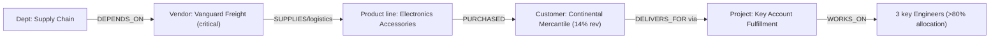
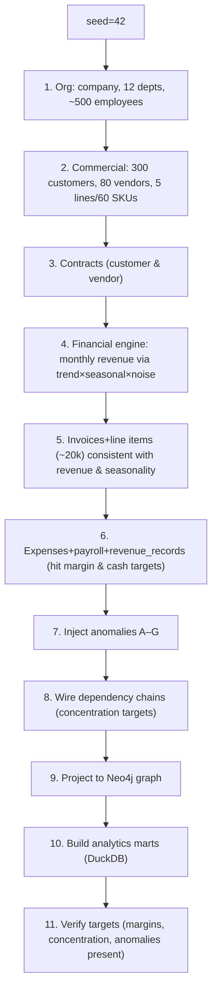

# AURORA — Demo Dataset Specification: "Nimbus Retail Systems"

> **Document status:** Foundational. Defines the synthetic demo company used to develop, test,
> and showcase AURORA end-to-end. The generator that produces it (designed here, built later)
> lives in [`packages/database`](../architecture/folder-structure.md#44-packagesdatabase--the-unified-company-data-model-m2).
>
> **Related:** [Data Model](data-model.md) ·
> [Financial, Risk & Simulation Models](../architecture/financial-risk-simulation-models.md) ·
> [MVP Scope](../roadmap/mvp-scope.md)

---

## 1. Purpose & design goals

"Nimbus Retail Systems" is a fictional **mid-market omnichannel retailer + B2B wholesale
supplier**. It exists so that *every* AURORA module has realistic data to operate on, and so
demos tell a coherent story.

The dataset is engineered to make AURORA's signature features **visibly fire**:

| AURORA capability | What the data must contain |
|-------------------|----------------------------|
| Financial Intelligence | 3 years of revenue/expense/payroll with realistic margins & trends |
| Forecasting | Strong, learnable **seasonality** + growth trend (so forecasts look credible) |
| Risk Genome | Built-in **concentration** (a few big customers/vendors) and a **liquidity dip** |
| Knowledge Graph | Real **dependency chains** (vendor → product → top customer → project) |
| Simulation | A "lose top customer" / "key vendor fails" scenario that meaningfully moves outcomes |
| Anomaly/Explainability | **Injected anomalies** (expense spike, revenue dip) that the system should flag and explain |

**Determinism:** generation is seeded (default `seed=42`) so the demo is reproducible across
environments and CI.

---

## 2. Company profile

| Attribute | Value |
|-----------|-------|
| Name | Nimbus Retail Systems |
| Slug | `nimbus` |
| Industry | Omnichannel retail & B2B wholesale |
| Founded (data start) | 36 months before "today" (rolling) |
| Base currency | USD |
| Fiscal year start | January |
| Headcount | ~500 employees |
| Departments | 12 |
| Customers | 300 (mix of B2B wholesale accounts + large retail/marketplace channels) |
| Vendors | 80 |
| Product lines | 5 (with ~60 SKUs total) |
| Invoices | ~20,000 over 36 months |
| Financial history | 36 monthly periods (revenue, expenses, payroll, cash) |
| Annual revenue (most recent year) | ~$48–60M (target, see §4) |

---

## 3. Entity volumes & attribute distributions

### 3.1 Departments (12)

| Department | Code | Headcount (approx) | Annual budget (approx) | Notes |
|-----------|------|--------------------|------------------------|-------|
| Executive | EXEC | 8 | $3.2M | C-suite + EAs |
| Finance | FIN | 22 | $3.0M | incl. payroll/AP/AR |
| Sales | SALES | 90 | $11M | largest revenue driver |
| Marketing | MKT | 35 | $6.5M | seasonal spend |
| Operations | OPS | 70 | $7M | fulfillment |
| Supply Chain | SCM | 45 | $5.5M | vendor management |
| Engineering | ENG | 60 | $9M | e-commerce platform |
| Product | PROD | 18 | $3M | merchandising/product |
| Customer Support | CS | 65 | $4.5M | seasonal staffing |
| Warehouse | WH | 55 | $4M | logistics labor |
| HR / People | HR | 12 | $1.8M | — |
| Legal & Compliance | LEGAL | 10 | $2.2M | contracts/compliance |

Headcounts sum to ~500. Each department has a `head_employee_id`, a hierarchy (most report to
EXEC), and a monthly budget = annual/12 with small variance.

### 3.2 Employees (~500)
- **Salary bands by role tier:** IC ($55k–$120k), Manager ($120k–$180k), Director ($180k–$260k),
  VP/C-level ($260k–$500k). Sampled per department mix.
- **Employment type:** ~85% full_time, ~10% contractor, ~5% part_time.
- **Tenure:** hire dates spread across the 3 years + pre-history; ~6% terminated (with
  `termination_date`) to create realistic attrition.
- **Key-person concentration (for risk):** Engineering has 3 employees each allocated >80% to
  the single most important platform Project → drives Talent/key-person risk.

### 3.3 Customers (300)
- **Segments:** `enterprise` wholesale (40), `smb` wholesale (210), `retail/marketplace`
  channels (50).
- **Revenue distribution: deliberately Pareto.** Top 10 customers ≈ **45%** of revenue; the
  single largest ("Continental Mercantile Group") ≈ **14%** of revenue → this is the
  concentration the Risk Genome flags and the simulation removes.
- **Region:** NA (60%), EU (25%), APAC (15%).
- **Lifecycle:** ~12% `churned` over the period (with `churn_date`), ~5% `prospect`.

### 3.4 Vendors (80)
- **Categories:** materials/inventory suppliers (30), logistics (12), SaaS/tech (15),
  marketing/agencies (10), facilities (8), professional services (5).
- **Spend distribution: also Pareto.** Top 5 vendors ≈ **40%** of spend; one logistics vendor
  ("Vanguard Freight Co.") is marked `criticality='critical'` and is a **single point of
  failure** for fulfilling the top product line → drives Vendor/Supply risk and the
  "key vendor fails" simulation.

### 3.5 Products (5 lines, ~60 SKUs)

| Product line | SKUs | Price band | Gross margin target | Seasonality |
|-------------|------|-----------|---------------------|-------------|
| Home & Living | 16 | $20–$300 | ~42% | Q4 peak (holidays) |
| Apparel | 14 | $15–$150 | ~55% | Spring + Q4 peaks |
| Electronics Accessories | 12 | $10–$200 | ~30% | strong Q4 peak |
| Outdoor & Seasonal | 10 | $25–$500 | ~48% | Q2–Q3 peak (summer) |
| Wholesale Bulk Goods | 8 | $200–$5,000 | ~22% | steadier, slight Q4 |

Each product has `unit_price_cents` and `unit_cost_cents` consistent with its margin target.
The **Electronics Accessories** line depends on the critical vendor (§3.4).

### 3.6 Contracts
- ~120 customer contracts (concentrated on enterprise/SMB wholesale; large ones tied to top
  customers) and ~50 vendor contracts (logistics, SaaS, materials).
- Values consistent with the customer's/vendor's annualized volume; mix of `auto`/`manual`
  renewals; a few `expired`/near-expiry to create renewal risk.

### 3.7 Invoices & line items (~20,000)
- ~20,000 invoices over 36 months (≈ 555/month average, scaled by seasonality — more in peak
  months).
- 1–6 line items each, referencing products consistent with the customer's segment.
- Status mix: ~80% `paid`, ~12% `issued`, ~5% `overdue`, ~3% `void`; `paid_date` lag sampled
  from a realistic AR aging distribution (net-30/45/60).
- `total_cents = subtotal + tax`; line `amount = quantity × unit_price`.

### 3.8 Expenses & payroll
- Monthly **payroll** expense per department derived from employee salaries (the largest cost).
- **COGS** expenses tied to product sales volume (so gross margin lands near targets).
- Operating expenses by category (marketing, rent, SaaS, logistics, facilities) per month with
  realistic ratios; marketing spend is **seasonal** (ramps before Q4).
- `revenue_record` rows generated per customer×product×month consistent with invoices, to feed
  the analytics marts and forecasting cleanly.

### 3.9 Projects
- ~25 active projects across departments (e.g., "E-commerce Replatform," "Warehouse Automation,"
  "Holiday Campaign"). A few are `red`/over budget (`spent_cents > budget_cents`) to drive
  operational risk and give the dashboard something to flag.

---

## 4. Financial shape: trend, seasonality & targets

### 4.1 Baseline model
Monthly revenue is generated from a composable model:

```
revenue(month) = base × trend(month) × seasonal(month) × noise(month) ± injected_anomalies
```

- **Base:** ~$3.0M/month at the start of the 3-year window.
- **Trend:** ~**18% YoY** compound growth (so the company is clearly growing) → most recent year
  lands at roughly **$48–60M** annual revenue.
- **Seasonal multipliers (retail profile):**

| Month | Multiplier | | Month | Multiplier |
|-------|-----------|---|-------|-----------|
| Jan | 0.82 | | Jul | 0.98 |
| Feb | 0.85 | | Aug | 1.02 |
| Mar | 0.95 | | Sep | 1.05 |
| Apr | 0.98 | | Oct | 1.18 |
| May | 1.00 | | Nov | **1.45** |
| Jun | 1.02 | | Dec | **1.55** |

  (Strong Q4 holiday peak — the dominant, learnable seasonal signal for forecasting.)
- **Noise:** multiplicative, ~N(1, 0.04), clipped, so series is realistic but not chaotic.

### 4.2 Margin & cost targets
- **Gross margin:** trends ~38% → ~41% over the 3 years (blended across product lines).
- **Operating margin:** ranges roughly 6%–12%, dipping during the injected liquidity event.
- **Payroll:** ~45–52% of operating expense.

### 4.3 Cash & runway
- Starting cash balance ~$6.5M; monthly cash = prior + collections − disbursements.
- Engineered so **cash runway tightens noticeably in months 20–24** (see anomaly C below),
  giving the Liquidity risk dimension and the dashboard a real story.

---

## 5. Injected anomalies (for detection & explainability)

These are deliberately planted so AURORA's anomaly flags, risk scores, and the explainability
layer have ground truth to surface. Each is documented so tests can assert detection.

| ID | Anomaly | Where | Magnitude | Should trigger |
|----|---------|-------|-----------|----------------|
| **A** | Marketing expense spike | Marketing, month 14 | +180% vs. trend (failed campaign) | Expense anomaly flag; budget-variance alert; explainability attributes the spike |
| **B** | Revenue dip | Company, month 17 | −22% vs. seasonal expectation (supply disruption) | Forecast residual flag; Operational + Market risk uptick |
| **C** | Liquidity squeeze | Cash, months 20–24 | runway falls from ~14mo → ~5mo | Liquidity risk → `high`; recommendation to open credit line |
| **D** | Customer concentration creep | Top customer, months 24–36 | grows 9%→14% of revenue | Customer-Concentration risk rising trend |
| **E** | Vendor delivery slip | Critical logistics vendor, month 28 | on-time rate drop | Vendor/Supply risk; graph impact analysis |
| **F** | Margin erosion | Electronics line, months 30–36 | unit cost +12% (input inflation) | Gross-margin decline flag; product-mix recommendation |
| **G** | Attrition cluster | Engineering, month 32 | 3 key-person departures | Talent risk spike; key-person dependency in graph |

---

## 6. Dependency relationships (for the knowledge graph & simulation)

The generator wires explicit chains so graph traversal and simulation produce non-trivial,
explainable results:



This single chain means a "lose Continental Mercantile" or "Vanguard Freight fails" scenario
cascades through revenue, a product line, a project, key people, and a department — exactly the
multi-domain effect AURORA is built to reveal.

**Concentration targets (so risk scores are meaningful):**
- Revenue: top customer ~14%, top 10 ~45% (HHI computed in
  [Models §4](../architecture/financial-risk-simulation-models.md#4-the-enterprise-risk-genome)).
- Spend: top vendor ~12%, top 5 ~40%.
- Product: Electronics Accessories ~28% of revenue (and margin-pressured per anomaly F).

---

## 7. Generation approach

> The generator is **designed here**; implementation is a later task in
> [`packages/database`](../architecture/folder-structure.md#44-packagesdatabase--the-unified-company-data-model-m2),
> invoked via `python -m aurora.seed --demo nimbus` (see [README quickstart](../../README.md#quickstart-planned)).

### 7.1 Pipeline (deterministic, seeded)



### 7.2 Techniques
- **Libraries:** NumPy (distributions/seeding), Faker (names/addresses), pandas (assembly).
- **Top-down financials:** generate the monthly revenue *curve first*, then allocate it down to
  customers/products/invoices so totals reconcile (invoices ≈ revenue ≈ marts).
- **Pareto allocation:** customer/vendor shares drawn from a power-law to hit concentration
  targets exactly (post-adjust the top accounts).
- **Referential consistency:** every invoice → existing customer + products; every expense →
  existing vendor/department; revenue_records reconcile to invoices.
- **Idempotent seeding:** running the seeder wipes & recreates the `nimbus` tenant only (never
  touches other tenants), so it's safe to re-run.

### 7.3 Verification (self-check the seeder runs)
After generation, the seeder asserts the dataset matches its spec, so demos never silently drift:

| Check | Expected |
|-------|----------|
| Departments | = 12 |
| Employees | 480–520 |
| Customers / Vendors | 300 / 80 |
| Product lines / SKUs | 5 / 55–65 |
| Invoices | 19,000–21,000 |
| Months of financials | = 36 |
| Most-recent-year revenue | $45M–$62M |
| Blended gross margin (recent yr) | 39%–43% |
| Top customer revenue share | 13%–15% |
| Top-5 vendor spend share | 38%–42% |
| Anomalies A–G | all present & detectable |
| Graph nodes/edges | non-empty; dependency chain (§6) exists |

---

## 8. Demo users (seeded logins)

So every persona can be demoed (passwords printed by the seeder; RBAC per
[Architecture §7.2](../architecture/system-architecture.md#72-authorization-rbac)):

| Name | Email | Role |
|------|-------|------|
| Dana Reyes | `ceo@nimbus.test` | CEO |
| Marcus Lin | `cfo@nimbus.test` | CFO |
| Priya Anand | `coo@nimbus.test` | COO |
| Sofia Marin | `strategy@nimbus.test` | Chief Strategy Officer |
| Tom Becker | `analyst@nimbus.test` | Finance Analyst |
| Wei Zhang | `ops@nimbus.test` | Operations Manager |
| Aisha Khan | `depthead@nimbus.test` | Department Head (Sales) |
| admin | `admin@nimbus.test` | System Administrator |

---

## 9. Where to go next
- The schema these rows populate → [Data Model](data-model.md)
- The math that consumes the dataset → [Financial, Risk & Simulation Models](../architecture/financial-risk-simulation-models.md)
- Where the seeder lives → [Folder Structure](../architecture/folder-structure.md#44-packagesdatabase--the-unified-company-data-model-m2)
- When it gets built → [Implementation Roadmap](../roadmap/implementation-roadmap.md)
