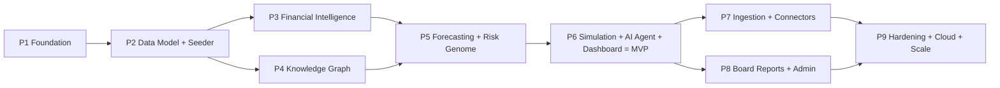

# AURORA — Implementation Roadmap

> **Document status:** Foundational. Sequences the build into **9 phases** with deliverables,
> dependencies, and per-phase acceptance criteria. Phases 1–6 culminate in the
> [MVP](mvp-scope.md); phases 7–9 harden and scale it.
>
> **Related:** [MVP Scope](mvp-scope.md) ·
> [System Architecture](../architecture/system-architecture.md) ·
> [Folder Structure](../architecture/folder-structure.md) ·
> [Deployment Guide](../deployment/deployment-guide.md)

---

## 1. Sequencing principle

Build **bottom-up through the dependency graph, then vertical to value**: foundation → data →
intelligence → decision → experience, with hardening last. Each phase ends with something
runnable and testable against the [Nimbus demo dataset](../data-model/demo-dataset-spec.md).

> **Effort labels** are relative T-shirt sizes, not calendar commitments. The **MVP line** is at
> the end of Phase 6.

---

## 2. Phases

### Phase 1 — Foundation & scaffolding  ·  size: M
**Goal:** an empty-but-running monorepo + local stack + auth.

**Deliverables**
- Monorepo tooling (pnpm/turbo + uv/Poetry), shared `packages/config`, lint/format.
- `apps/api` FastAPI skeleton (health, error envelope, settings, logging) and `apps/web`
  Next.js skeleton (shell, theme, ⌘K) per [UI/UX](../architecture/ui-ux-plan.md).
- **Docker Compose** stack (web, api, worker, Postgres, Neo4j, Redis, MinIO).
- **Auth + RBAC core** ([Architecture §7](../architecture/system-architecture.md#7-security-rbac--multi-tenancy)):
  login/refresh/me, JWT, permission guards, `AuthContext`, tenant scoping middleware.
- OpenAPI → `packages/types` generation pipeline.
- GitHub Actions CI (lint + test + build).

**Depends on:** —
**Acceptance:** `docker compose up` serves web+api; a seeded admin can log in; a protected
endpoint enforces a permission; CI is green; types generate from OpenAPI.

---

### Phase 2 — Unified Data Model & demo seeder  ·  size: L
**Goal:** the canonical schema and a rich demo company to build against.

**Deliverables**
- All 21 entities as SQLAlchemy models + Alembic migrations + `TenantScopedMixin` + repositories
  ([Data Model](../data-model/data-model.md)).
- Optional Postgres RLS policies as the isolation backstop.
- **Nimbus seeder** (`packages/database`) generating the full
  [demo dataset](../data-model/demo-dataset-spec.md) incl. anomalies & dependency chains, with the
  built-in verification self-checks.
- Basic read APIs + list/detail UIs for core entities (customers, vendors, invoices) with
  pagination/filtering.

**Depends on:** P1
**Acceptance:** `aurora.seed --demo nimbus` reproduces a dataset that passes every check in
[Demo Spec §7.3](../data-model/demo-dataset-spec.md#73-verification-self-check-the-seeder-runs);
tenant-isolation test passes; entity lists render in the UI.

---

### Phase 3 — Financial Intelligence Engine  ·  size: M
**Goal:** the financial truth + analytics marts.

**Deliverables**
- DuckDB analytics marts ([Data Model §6](../data-model/data-model.md#6-analytics-layer-duckdb--clickhouse))
  refreshed from canonical data.
- All financial calculators in `packages/ml`
  ([Models §2](../architecture/financial-risk-simulation-models.md#2-financial-intelligence-formulas))
  + the metric registry.
- `/metrics/*` and `/financials/*` APIs ([API §6.3](../api/api-specification.md#63-dashboard--financial-metrics-module-4)).
- **Explainability for metrics** (formula + inputs).
- First **dashboard KPI strip + trend chart** + the **Financials** page.

**Depends on:** P2
**Acceptance:** KPIs (margins, burn, runway, variance, concentration) match golden values on
Nimbus; `/explain/metric/*` returns formula+inputs; KPI strip renders correct figures.

---

### Phase 4 — Knowledge Graph  ·  size: M
**Goal:** relationships, concentration, and impact analysis.

**Deliverables**
- Neo4j model + tenant-scoped sync from canonical data (`packages/graph`).
- Cypher library: concentration + **impact analysis** + neighborhood queries
  ([Data Model §5.3](../data-model/data-model.md#53-example-cypher-concentration--impact)).
- `/graph/*` APIs ([API §6.4](../api/api-specification.md#64-knowledge-graph-module-3)).
- **Graph explorer** UI (React Flow) with impact mode.

**Depends on:** P2 (parallelizable with P3)
**Acceptance:** selecting the critical vendor returns the correct impact subtree + revenue-at-risk
matching the [demo dependency chain](../data-model/demo-dataset-spec.md#6-dependency-relationships-for-the-knowledge-graph--simulation);
graph renders and is navigable.

---

### Phase 5 — Forecasting & Risk Genome  ·  size: L
**Goal:** look forward and quantify risk.

**Deliverables**
- Forecasting service (`packages/ml`): one solid method (Prophet) with CIs + rolling-origin
  backtest; `/forecasts/*` async jobs + `forecast:{id}` progress
  ([Models §3](../architecture/financial-risk-simulation-models.md#3-forecasting-methodology)).
- **Risk Genome:** all 8 dimension scorers with normalization, drivers, explanations, and
  recommended actions ([Models §4](../architecture/financial-risk-simulation-models.md#4-the-enterprise-risk-genome));
  `/risk/*` APIs; `risk_signal` history.
- Explainability: forecast feature importance (SHAP) + risk driver attribution.
- Dashboard **forecast fan chart** + **risk genome panel**; the **Risk** page.

**Depends on:** P3, P4
**Acceptance:** revenue forecast meets a backtest MAPE target on Nimbus with ~80% interval
coverage; the genome reproduces the engineered conditions (Liquidity "high",
Customer-Concentration elevated) with sensible drivers/actions; explain endpoints return
attributions.

---

### Phase 6 — Simulation, AI Agent & Executive Dashboard → **MVP**  ·  size: L
**Goal:** close the decision loop; ship the MVP.

**Deliverables**
- **Simulation engine** (`packages/simulations`): vectorized Monte Carlo, `customer_churn` +
  `expense_change` shocks + one uncertain driver, distributions + risk deltas + recommendations,
  graph-coupled effects; `/scenarios/*` + `/simulations/*` + `simulation:{id}` progress
  ([Models §5](../architecture/financial-risk-simulation-models.md#5-decision-simulation-engine-monte-carlo)).
- **AI Agent** with the **mock provider** + provider abstraction; RAG + simulate/metric tools;
  `AIInteraction` logging; `/agent/*` ([API §6.8](../api/api-specification.md#68-executive-ai-agent-module-8)).
- **Executive Dashboard** complete ([UI/UX §4](../architecture/ui-ux-plan.md#4-executive-dashboard-layout-overview));
  **Simulator** + **AI Agent** pages; global **Explain** overlay; recommendations feed.
- E2E happy-path test (login → dashboard → simulate → explained answer) on the mock provider.

**Depends on:** P5
**Acceptance:** **all** [MVP acceptance criteria](mvp-scope.md#5-mvp-acceptance-criteria) pass —
including the 5-minute demo narrative — with `AI_PROVIDER=mock` and no external keys.

> **★ MVP milestone reached at the end of Phase 6.**

---

### Phase 7 — Ingestion depth & live connectors  ·  size: M
**Goal:** real "bring your own data."

**Deliverables**
- Hardened file ingestion (schema-mapping UI, dedup, richer validation, rejected-row drill-down).
- First **live connectors** (accounting + CRM) behind the connector framework; `data_source`
  health; `ingestion:{job_id}` polish.
- Idempotent re-sync + lineage surfaced in the **Data Sources** UI.

**Depends on:** P6
**Acceptance:** a real CSV and at least one live connector ingest end-to-end, update metrics/
graph/risk, and show lineage + job status; re-sync is idempotent.

---

### Phase 8 — Board Reports & Admin Console  ·  size: M
**Goal:** export decisions and run the tenant.

**Deliverables**
- **Board Report Generator:** section composer + AI narration + **PDF/slide rendering** (worker)
  + approval workflow + export; `/board-reports/*`.
- **Admin Console:** user/role management UI, data-source registry, **audit-log viewer**.
- "Add to board report" wired from simulations/risk/recommendations.

**Depends on:** P6 (parallelizable with P7)
**Acceptance:** a CFO assembles, narrates, approves, and exports a Q board pack from live Nimbus
data; admins manage users/roles and browse the audit log.

---

### Phase 9 — Hardening, cloud & scale  ·  size: L
**Goal:** production-ready and scalable.

**Deliverables**
- **AWS deploy** (ECS/Fargate, RDS, ElastiCache, S3, CloudWatch, Secrets Manager, ALB) +
  optional **Terraform**; CD pipeline ([Deployment Guide](../deployment/deployment-guide.md)).
- **Scale swaps:** DuckDB → ClickHouse behind the query layer; forecast **ensemble** (SARIMAX +
  driver regression); more simulation shock types (price, vendor_failure cascade, hiring).
- **Security hardening:** SSO/OIDC, field-level encryption for sensitive fields, rate limiting,
  stronger tenant-isolation options (schema-per-tenant path).
- Observability (dashboards/alerts), load/perf testing, and self-serve multi-tenant onboarding
  + (optional) billing/usage.

**Depends on:** P7, P8
**Acceptance:** a production AWS environment runs the full stack via CD; ClickHouse serves
analytics with no API change; ensemble forecasts beat the single-method baseline on backtests;
security review + load test pass.

---

## 3. Roadmap summary

| Phase | Theme | Size | Depends on | Exit = |
|-------|-------|:----:|------------|--------|
| 1 | Foundation & scaffolding | M | — | running stack + auth/RBAC + CI |
| 2 | Data model + Nimbus seeder | L | 1 | verified demo dataset + isolation |
| 3 | Financial Intelligence | M | 2 | correct KPIs + metric explain |
| 4 | Knowledge Graph | M | 2 | impact analysis + graph UI |
| 5 | Forecasting + Risk Genome | L | 3,4 | forecasts w/ CIs + 8-dim genome |
| 6 | **Simulation + Agent + Dashboard** | L | 5 | **★ MVP acceptance** |
| 7 | Ingestion + connectors | M | 6 | live data in, with lineage |
| 8 | Board Reports + Admin | M | 6 | exportable packs + admin/audit |
| 9 | Hardening + cloud + scale | L | 7,8 | AWS CD + scale swaps + security |

---

## 4. Cross-cutting workstreams (every phase)
- **Testing:** unit (formulas/scorers), contract (OpenAPI), E2E (demo narrative) — grows phase by
  phase; golden values on Nimbus.
- **Explainability:** each new output ships with its explanation, never retrofitted.
- **Docs:** keep these design docs in sync; record new decisions as ADRs in
  [Architecture §12](../architecture/system-architecture.md#12-architecture-decision-records-summary).
- **Security/RBAC & tenant scoping:** enforced from Phase 1 and re-verified as modules land.

---

## 5. Risks & mitigations

| Risk | Mitigation |
|------|------------|
| Scope creep beyond the vertical slice | Hard gate at Phase 6 = MVP acceptance; defer per [MVP §4](mvp-scope.md#4-out-of-scope-mvp--deferred-to-later-phases) |
| Forecast/risk feel "made up" | Backtesting + explicit formulas + explainability from Phase 5 |
| Demo data unconvincing | Engineered anomalies/concentration + seeder self-checks (Phase 2) |
| AI dependency/keys block progress | Mock provider is the default through MVP |
| Polyglot/graph complexity | Graph is a rebuildable projection; introduced isolated in Phase 4 |
| Cost/perf at scale | DuckDB→ClickHouse and Compose→ECS are config-level swaps (Phase 9) |

---

## 6. Where to go next
- What exactly the MVP must do → [MVP Scope](mvp-scope.md)
- How to run each phase's stack → [Deployment Guide](../deployment/deployment-guide.md)
- The contracts each phase implements → [API Specification](../api/api-specification.md)
