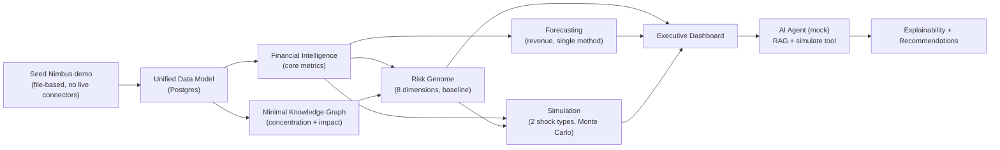

# AURORA — MVP Scope

> **Document status:** Foundational. Defines the **runnable vertical slice** that proves
> AURORA's core value, with explicit in/out scope and acceptance criteria. The build order to
> get here (and beyond) is in the [Implementation Roadmap](implementation-roadmap.md).
>
> **Related:** [Overview & Vision](../00-overview-and-vision.md) ·
> [System Architecture](../architecture/system-architecture.md) ·
> [Demo Dataset](../data-model/demo-dataset-spec.md) ·
> [Financial, Risk & Simulation Models](../architecture/financial-risk-simulation-models.md)

---

## 1. MVP thesis

> **The MVP must let a CFO log into "Nimbus Retail Systems," see the company's financial truth
> and risk genome, ask the AI agent a question, run one "what-if" simulation, and get an
> explained, actionable answer — end to end, on a laptop, with no external AI key required.**

This is the smallest slice that demonstrates the four pillars
([README](../../README.md#the-four-pillars)) — *see everything, model the business, connect the
dots, advise & decide* — as one coherent loop, rather than disconnected features.

### Guiding rules
- **Vertical, not horizontal.** One thin path through *all* layers beats many half-built modules.
- **Demo-data-first.** Build against the seeded [Nimbus dataset](../data-model/demo-dataset-spec.md)
  so the experience is rich from day one; live connectors come later.
- **Mock AI by default.** The [provider abstraction](../architecture/system-architecture.md#8-ai-provider-abstraction)
  ships with the offline mock so the MVP works with zero keys; real providers are config-on.
- **Explainable from the start.** Even the MVP exposes formulas/evidence for what it shows.

---

## 2. The MVP vertical slice

---

## 3. In scope (MVP)

### 3.1 Platform & foundation
- Monorepo skeleton ([Folder Structure](../architecture/folder-structure.md)) with `apps/web`,
  `apps/api`, and the packages it needs (`database`, `ml`, `graph`, `simulations`, `ui`, `types`,
  `config`).
- **Docker Compose** stack: web, api, worker, Postgres, Neo4j, Redis, MinIO
  ([Deployment Guide](../deployment/deployment-guide.md)).
- **Auth + RBAC** for the 8 seeded roles; single-tenant-in-practice but **multi-tenant data model
  enforced** (every query scoped by `company_id`).

### 3.2 Data
- Full [Unified Data Model](../data-model/data-model.md) schema + migrations (all 21 entities).
- **Nimbus demo seeder** producing the complete dataset incl. anomalies & dependency chains.
- **File ingestion (CSV/XLSX)** for the core entities (invoices, expenses, customers, vendors,
  employees) with validation + lineage — enough to demo "bring your own data."

### 3.3 Intelligence
- **Financial Intelligence:** margins, burn, runway, budget variance, concentration (all of
  [Models §2](../architecture/financial-risk-simulation-models.md#2-financial-intelligence-formulas)).
- **Forecasting:** revenue forecast with confidence intervals + backtest accuracy (one solid
  method, e.g., Prophet; ensemble deferred).
- **Risk Genome:** all **8 dimensions** scored with drivers, explanations, and recommended
  actions (baseline scorers; refinement later).
- **Knowledge Graph:** sync + the **concentration** and **impact-analysis** queries (enough to
  power risk + simulation + the graph view).

### 3.4 Decision
- **Simulation:** Monte Carlo with **two shock types** — `customer_churn` and `expense_change` —
  plus one uncertain driver (revenue growth), returning distributions, risk deltas, and ranked
  recommendations, with **WebSocket progress**.
- **AI Agent (mock provider):** RAG over metrics + graph, able to call the **simulate** and
  **metric-lookup** tools, returning grounded answers with citations.
- **Explainability:** formula+inputs for metrics; driver attribution for risk; feature importance
  for the forecast.

### 3.5 Experience
- **Executive Dashboard** ([UI/UX §4](../architecture/ui-ux-plan.md#4-executive-dashboard-layout-overview))
  with KPI strip, revenue+forecast, risk genome, cash/runway, alerts, recommendations, and the
  inline agent.
- **Risk page**, **Graph explorer**, **Simulator**, **AI Agent**, and **Data Sources** pages
  (MVP versions).
- Dark-first design system applied; responsive to tablet.

### 3.6 Quality & ops
- Unit tests for all formulas/scorers (golden values on Nimbus), API contract tests, and one E2E
  happy-path (login → dashboard → simulate → explained answer) using the mock provider.
- GitHub Actions CI (lint + test + build).

---

## 4. Out of scope (MVP) — deferred to later phases

| Deferred | Why / when |
|----------|-----------|
| Live SaaS connectors (QuickBooks/Salesforce/HRIS) | File ingestion proves the flow; connectors are Phase 7+ |
| Full multi-tenant onboarding/billing | Data model is multi-tenant; self-serve tenant mgmt later |
| Board Report **rendering/export** (PDF/slides) | Report *data* assembled; polished export is Phase 8 |
| Forecast **ensemble** + SARIMAX + driver regression | One method in MVP; ensemble in Phase 5 |
| Additional simulation shock types (price, vendor_failure cascade, hiring) | 2 shocks prove the engine; expand in Phase 6 |
| Real LLM provider tuning, streaming polish, agent memory | Mock proves UX; providers/polish in Phase 6 |
| ClickHouse analytics | DuckDB suffices at MVP scale |
| AWS/Terraform production deploy | Compose first; cloud in Phase 9 |
| SSO/OIDC, field-level encryption, advanced audit UI | Security hardening in Phase 9 |
| Mobile-optimized layouts | Desktop/tablet first |

---

## 5. MVP acceptance criteria

The MVP is "done" when **all** of the following pass against the seeded Nimbus tenant:

### 5.1 Functional
1. `docker compose up` brings up the full stack; `python -m aurora.seed --demo nimbus` populates
   the dataset and prints demo logins.
2. A user can log in as each of the 8 roles; **nav and data respect RBAC/scope**.
3. The **dashboard** loads with correct KPIs, a revenue forecast with CI, the **8-dimension risk
   genome**, cash/runway, alerts (incl. the injected anomalies), and recommendations.
4. **Risk genome** shows Liquidity ≈ "high" and Customer-Concentration elevated, each with
   drivers + explanation + actions (matching the engineered demo conditions).
5. The **graph explorer** renders entities and, on selecting the critical vendor, shows the
   impact subtree + revenue-at-risk.
6. In the **simulator**, running "lose top customer + 6% eng raise" (10k trials) returns a
   distribution, risk deltas, and ≥3 ranked recommendations, with live progress.
7. The **AI agent** (mock) answers "What's our runway if revenue drops 15%?" by calling the
   simulate tool and returns a grounded answer **with citations**.
8. Every dashboard metric, the forecast, and each risk score expose a working **Explain** view.
9. **File ingestion**: uploading a sample invoices CSV validates, ingests, and updates metrics,
   with a visible job + lineage.

### 5.2 Non-functional
- **No external keys required** — the entire flow works with `AI_PROVIDER=mock`.
- **Performance (demo scale):** dashboard initial load < 2.5s; a 10k-trial simulation completes
  < 10s end-to-end; metric endpoints < 500ms p95.
- **Tenant isolation:** automated test proves one tenant cannot read another's data.
- **Reproducibility:** seeded dataset + simulation seeds yield stable, testable outputs.
- **CI green:** lint, unit, contract, and the E2E happy-path all pass.

### 5.3 Demo narrative (the proof)
A single 5-minute click-through succeeds: **log in as CFO → read the dashboard → notice the
liquidity alert → ask the agent → run the simulation → review explained recommendations.** This
*is* the MVP.

---

## 6. Success metrics (post-MVP signal)
- Time from question → explained, quantified answer: **< 1 minute**.
- A new evaluator can complete the demo narrative unaided in **< 10 minutes**.
- Every number on screen is traceable to a formula or source record (100% explainability coverage
  of MVP surfaces).

---

## 7. Where to go next
- The phase-by-phase plan to build this and beyond → [Implementation Roadmap](implementation-roadmap.md)
- What to run it on → [Deployment Guide](../deployment/deployment-guide.md)
- The data it stands on → [Demo Dataset](../data-model/demo-dataset-spec.md)
